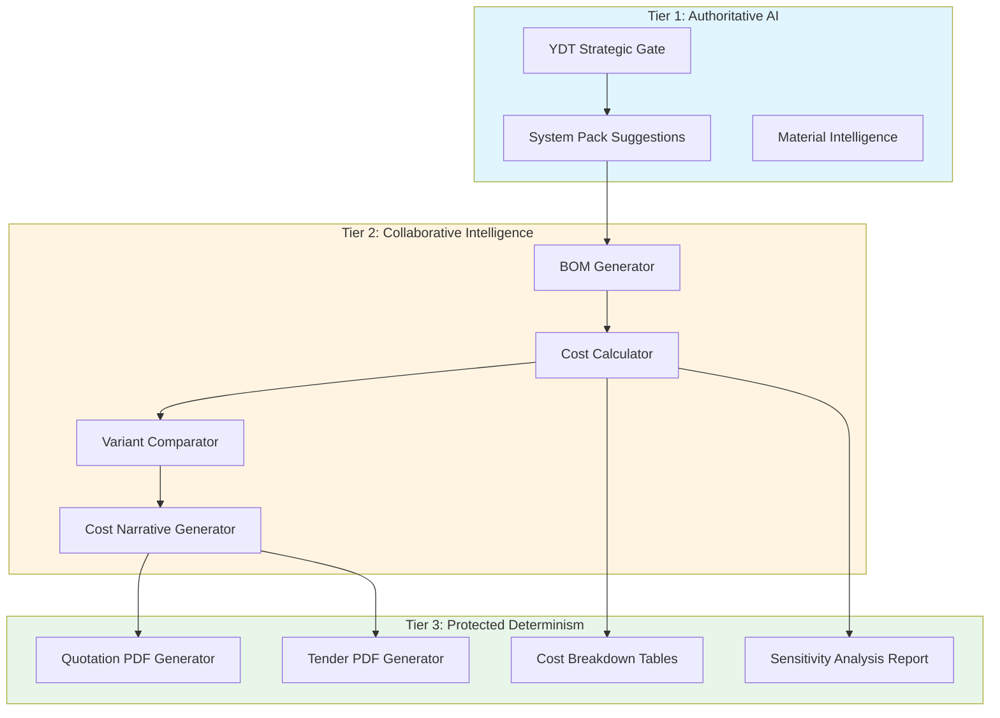
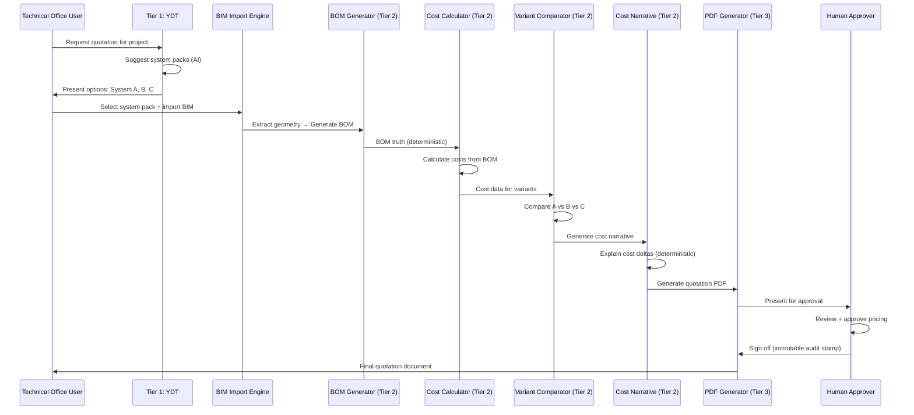
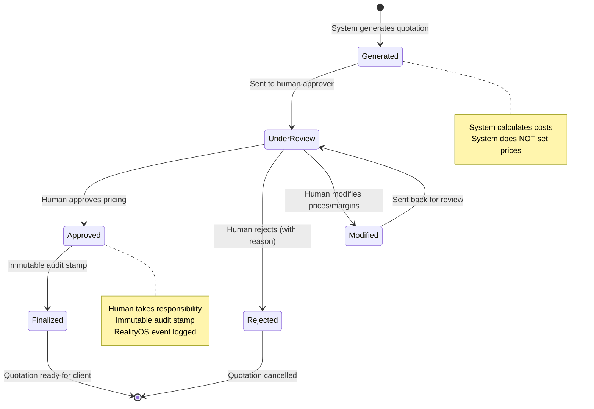

# Quotation Engine Architecture: Constitutional-Safe Design

**Document Classification:** Architectural Specification  
**Authority:** Design Contract (Supreme Source: Phase 2 Implementation)  
**Status:** Binding  
**Date:** 2026-01-01  
**Version:** 1.0

---

## Executive Summary

This document defines the constitutional-safe architecture for ALMONA's Quotation Engine—the #1 commercial gap for gold-tier competition. The architecture explicitly separates **pricing advice** (prohibited) from **cost calculation** (permitted), ensuring legal defensibility while matching Orgadata/Klaes capabilities.

**Critical Constraint:** The Quotation Engine never provides pricing advice. It provides **deterministic cost calculations from BOM truth**, with **human responsibility** for all pricing decisions.

---

## 1. Architecture Overview

### 1.1 Three-Tier Authority Model

The Quotation Engine operates across all three constitutional tiers:



**Key Boundaries:**
- **Tier 1:** Suggests system packs, provides material intelligence (AI-assisted)
- **Tier 2:** Generates BOMs, calculates costs, compares variants, generates narratives (AI + deterministic)
- **Tier 3:** Generates PDFs, tables, reports (100% deterministic, zero AI)

---

## 2. Data Flow: BOM Truth → Cost → Narrative

### 2.1 Complete Flow Diagram



### 2.2 Constitutional Boundaries in Flow

| Stage | What System Does | What System Does NOT Do | Human Responsibility |
|-------|------------------|-------------------------|---------------------|
| **Tier 1: System Pack Suggestions** | Suggests suitable system packs based on geometry | Does not recommend "best" option | User selects system pack |
| **Tier 2: BOM Generation** | Generates BOM from geometry + system pack | Does not modify geometry | User validates geometry |
| **Tier 2: Cost Calculation** | Calculates costs from BOM + material prices | Does not set prices or margins | User provides material prices |
| **Tier 2: Variant Comparison** | Compares costs of variants | Does not recommend which variant to choose | User decides based on comparison |
| **Tier 2: Cost Narrative** | Explains cost differences (factual) | Does not provide pricing advice | User interprets narrative |
| **Tier 3: PDF Generation** | Generates quotation PDF | Does not approve pricing | Human must approve before sending |

---

## 3. Tier 1: Authoritative AI (Strategic Gate)

### 3.1 System Pack Suggestions

**File:** `src/lib/quotation/tier1/SystemPackSuggester.ts`

**What It Does:**
- Analyzes BIM geometry (imported intent)
- Suggests suitable system packs from certified library
- Provides material intelligence (thermal, structural properties from system pack definitions)

**What It Does NOT Do:**
- Does not recommend "best" system pack
- Does not make pricing recommendations
- Does not perform engineering analysis

**Output:**
```typescript
interface SystemPackSuggestion {
  systemPackId: string;
  systemPackName: string;
  confidence: number; // 0-100, descriptive only
  suitabilityReasons: string[]; // Factual reasons from geometry
  materialProperties: {
    thermalBreak: boolean;
    structuralDepth: number; // mm
    glazingCapacity: number; // mm
  };
  // Explicitly NOT included:
  // - priceRecommendation
  // - bestChoice
  // - engineeringApproval
}
```

**Constitutional Safeguard:**
- All suggestions marked as "suggestions, not recommendations"
- User must explicitly select system pack
- No automatic selection based on "best" criteria

---

## 4. Tier 2: Collaborative Intelligence (Cost Calculation)

### 4.1 BOM Generator Integration

**File:** `src/lib/quotation/tier2/BOMToCostBridge.ts`

**Input:** BOM truth from `CurtainWallBOMGenerator.ts` (Tier 3, deterministic)

**Process:**
1. Receives BOM (parts, quantities, dimensions)
2. Applies material prices (from user-provided price list)
3. Calculates material costs (deterministic)
4. Applies labor rates (from user-provided rates)
5. Calculates labor costs (deterministic)

**Output:**
```typescript
interface CostCalculation {
  materialCost: number; // From BOM × prices
  laborCost: number; // From BOM × rates
  totalCost: number; // materialCost + laborCost
  costBreakdown: {
    partId: string;
    quantity: number;
    unitPrice: number;
    totalPrice: number;
  }[];
  // Explicitly NOT included:
  // - marginRecommendation
  // - finalPrice
  // - pricingAdvice
}
```

**Constitutional Safeguard:**
- All prices come from user-provided price lists (not system-generated)
- All rates come from user-provided rates (not system-generated)
- System calculates costs, never sets prices

---

### 4.2 Variant Comparator

**File:** `src/lib/quotation/tier2/VariantComparator.ts`

**What It Does:**
- Compares costs of multiple variants (System A vs B vs C)
- Calculates cost deltas (deterministic)
- Identifies cost drivers (factual analysis)

**What It Does NOT Do:**
- Does not recommend which variant to choose
- Does not provide pricing advice
- Does not make business decisions

**Output:**
```typescript
interface VariantComparison {
  variants: {
    variantId: string;
    systemPackName: string;
    totalCost: number;
    costBreakdown: CostCalculation;
  }[];
  costDeltas: {
    variantA: string;
    variantB: string;
    deltaAmount: number;
    deltaPercentage: number;
    costDrivers: string[]; // Factual: "Mullion depth increased from 120mm to 150mm"
  }[];
  // Explicitly NOT included:
  // - recommendedVariant
  // - bestValue
  // - pricingRecommendation
}
```

**Constitutional Safeguard:**
- All comparisons are factual (cost differences, not value judgments)
- No "best" or "recommended" language
- User decides which variant to use

---

### 4.3 Cost Narrative Generator (Cost Intelligence Layer)

**File:** `src/lib/quotation/tier2/CostNarrativeGenerator.ts`

**What It Does:**
- Generates deterministic explanations of cost differences
- Explains cost drivers (factual, from BOM deltas)
- Provides sensitivity analysis (if X changes, cost changes by Y%)

**What It Does NOT Do:**
- Does not provide pricing advice
- Does not recommend price adjustments
- Does not make business judgments

**Output:**
```typescript
interface CostNarrative {
  variantId: string;
  narrative: string; // Deterministic explanation
  costDrivers: {
    driver: string; // "Mullion depth increased from 120mm to 150mm"
    impact: string; // "+7.4% cost increase"
    reason: string; // Factual: "Deeper mullion requires more material"
  }[];
  sensitivityAnalysis: {
    parameter: string; // "Glass thickness"
    currentValue: string; // "6mm"
    alternativeValue: string; // "8mm"
    costImpact: string; // "+12.3% cost increase"
  }[];
  // Explicitly NOT included:
  // - pricingRecommendation
  // - shouldUseThisVariant
  // - businessAdvice
}
```

**Example Narrative:**
> "Option B costs 7.4% more than Option A because:
> - Mullion depth increased from 120mm to 150mm (+4.2% material cost)
> - Hardware set changed from Standard to Premium (+3.2% hardware cost)
> 
> Sensitivity: If glass thickness changes from 6mm to 8mm, cost increases by 12.3%."

**Constitutional Safeguard:**
- All narratives are factual (from BOM deltas, not AI inference)
- No judgmental language ("better", "recommended", "should")
- Clear disclaimer: "Cost calculations for information only. Pricing decisions require human judgment."

---

## 5. Tier 3: Protected Determinism (PDF Generation)

### 5.1 Quotation PDF Generator

**File:** `src/lib/quotation/tier3/QuotationPDFGenerator.ts`

**Input:** Cost calculations + narratives from Tier 2

**Process:**
1. Generates professional quotation PDF (100% deterministic)
2. Includes cost breakdown tables
3. Includes variant comparison
4. Includes cost narrative
5. Includes constitutional disclaimers (watermarked)

**Output Structure:**
```
Quotation PDF:
├── Header (Client name, project, date)
├── System Pack Selection (user-selected)
├── Cost Breakdown Table (deterministic from BOM)
├── Variant Comparison (if multiple variants)
├── Cost Narrative (factual explanations)
├── Sensitivity Analysis (if requested)
├── Constitutional Disclaimer (watermarked):
│   "Cost calculations are based on declared BOM truth and 
│    user-provided material prices. Pricing decisions require 
│    human judgment and business approval. This document does 
│    not constitute pricing advice."
└── Approval Section:
    ├── Reviewed by: [Name] [Date]
    ├── Approved for tender by: [Role] [Date]
    └── Immutable audit stamp (RealityOS event)
```

**Constitutional Safeguard:**
- Every page watermarked with disclaimer
- Approval section required (human responsibility)
- Immutable audit trail (RealityOS event logging)

---

### 5.2 Tender PDF Generator

**File:** `src/lib/quotation/tier3/TenderPDFGenerator.ts`

**Similar to Quotation PDF, but:**
- Client-facing format (less technical detail)
- Focus on variant comparison
- Clear cost narrative for client explanation
- Same constitutional disclaimers

---

## 6. Human Approval Workflow

### 6.1 Approval Flow Diagram



### 6.2 Human Responsibility Hooks

**File:** `src/lib/governance/HumanResponsibilityHooks.ts`

**What Humans Must Approve:**
- Final pricing (system calculates costs, human sets prices)
- Margin decisions (system shows costs, human adds margin)
- Variant selection (system compares, human decides)
- Tender submission (system generates, human approves)

**Immutable Audit Trail:**
```typescript
interface ApprovalStamp {
  quotationId: string;
  approvedBy: string; // Human name
  approvedRole: string; // Human role
  approvedDate: string; // ISO timestamp
  approvalReason?: string; // Optional reason
  modifiedPrices?: { // If human modified
    itemId: string;
    originalCost: number;
    modifiedPrice: number;
    reason: string;
  }[];
  realityOSEventId: string; // Immutable ledger reference
}
```

---

## 7. Constitutional Safeguards

### 7.1 Explicit Prohibitions

The Quotation Engine **MUST NOT**:

1. **Set Prices** - System calculates costs, humans set prices
2. **Recommend Margins** - System shows costs, humans decide margins
3. **Recommend Variants** - System compares, humans choose
4. **Provide Pricing Advice** - System provides facts, humans make decisions
5. **Make Business Judgments** - System calculates, humans judge

### 7.2 Required Disclaimers

Every quotation document **MUST** include:

```
CONSTITUTIONAL DISCLAIMER

This quotation contains cost calculations based on:
- BOM truth (deterministic from geometry + system pack)
- User-provided material prices
- User-provided labor rates

This document does NOT constitute:
- Pricing advice
- Business recommendations
- Engineering approval
- Legal certification

All pricing decisions require human judgment and business approval.
All cost calculations are for information purposes only.
```

### 7.3 Language Compliance

**Prohibited Language:**
- ❌ "We recommend Option A"
- ❌ "Best value option"
- ❌ "Should use this variant"
- ❌ "Optimal pricing"
- ❌ "Recommended margin"

**Permitted Language:**
- ✅ "Option A costs 7.4% more than Option B because..."
- ✅ "Cost comparison: Variant A vs B vs C"
- ✅ "If glass thickness increases from 6mm to 8mm, cost increases by 12.3%"
- ✅ "Cost breakdown based on BOM truth"

---

## 8. Legal, Enterprise, and Government Defense

### 8.1 Legal Defense Points

**If challenged in court or audit:**

1. **Explicit Disclaimers:** Every document includes constitutional disclaimer
2. **Human Responsibility:** All pricing decisions require human approval
3. **Deterministic Calculations:** All costs calculated from BOM truth (auditable)
4. **No AI in Pricing:** Tier 3 (PDF generation) is 100% deterministic
5. **Immutable Audit Trail:** All approvals logged in RealityOS (tamper-proof)

**Legal Position:**
> "ALMONA provides cost calculations, not pricing advice. All pricing decisions are made by licensed professionals with explicit approval. The system enforces constraints and calculates costs—it does not make business judgments."

### 8.2 Enterprise Defense Points

**For enterprise buyers concerned about authority:**

1. **Constitutional Boundaries:** Explicitly defined and enforced
2. **Human Override:** Always available, always auditable
3. **Transparency:** All calculations traceable to BOM truth
4. **No Black Box:** Every cost explained deterministically

**Enterprise Position:**
> "ALMONA respects human authority. The system calculates costs and enforces constraints—humans make all pricing and business decisions. Every decision is auditable and traceable."

### 8.3 Government Defense Points

**For government procurement:**

1. **Deterministic Process:** All calculations auditable
2. **No Bias:** No AI recommendations, only factual comparisons
3. **Full Transparency:** All cost drivers explained
4. **Immutable Records:** RealityOS audit trail

**Government Position:**
> "ALMONA provides transparent, auditable cost calculations. All pricing decisions are made by authorized personnel with full accountability. The system enforces constraints but does not make decisions."

---

## 9. Implementation File Structure

### 9.1 Tier 1 Files

```
src/lib/quotation/tier1/
├── SystemPackSuggester.ts          # AI suggestions (Tier 1)
├── MaterialIntelligence.ts        # Material properties (Tier 1)
└── types.ts                        # Tier 1 types
```

### 9.2 Tier 2 Files

```
src/lib/quotation/tier2/
├── BOMToCostBridge.ts              # BOM → Cost calculation
├── CostCalculator.ts                # Deterministic cost calculation
├── VariantComparator.ts              # Variant comparison
├── CostNarrativeGenerator.ts       # Cost intelligence layer
├── SensitivityAnalyzer.ts          # Sensitivity analysis
└── types.ts                         # Tier 2 types
```

### 9.3 Tier 3 Files

```
src/lib/quotation/tier3/
├── QuotationPDFGenerator.ts         # Quotation PDF (100% deterministic)
├── TenderPDFGenerator.ts            # Tender PDF (100% deterministic)
├── CostBreakdownTableGenerator.ts  # Cost tables
├── SensitivityReportGenerator.ts   # Sensitivity reports
└── types.ts                         # Tier 3 types
```

### 9.4 Governance Files

```
src/lib/governance/
├── HumanResponsibilityHooks.ts      # Approval workflow
├── ApprovalWorkflow.ts              # Approval state machine
└── QuotationAuditLogger.ts          # RealityOS event logging
```

### 9.5 UI Components

```
src/components/quotation/
├── QuotationWizard.tsx              # Main quotation UI
├── SystemPackSelector.tsx           # System pack selection
├── VariantComparisonPanel.tsx       # Variant comparison UI
├── CostIntelligencePanel.tsx         # Cost narrative display
├── ApprovalDialog.tsx                # Human approval UI
└── QuotationPDFViewer.tsx           # PDF preview
```

---

## 10. Success Criteria

### 10.1 Functional Criteria

- ✅ Generate multi-variant quotations (System A vs B vs C)
- ✅ Calculate costs from BOM truth (deterministic)
- ✅ Compare variants with cost deltas
- ✅ Generate cost narratives (factual explanations)
- ✅ Provide sensitivity analysis
- ✅ Generate professional PDFs (quotation + tender)
- ✅ Require human approval before finalization

### 10.2 Constitutional Criteria

- ✅ Zero pricing advice in any output
- ✅ All prices from user-provided price lists
- ✅ All approvals require human responsibility
- ✅ All outputs include constitutional disclaimers
- ✅ 100% Tier 3 purity in PDF generation
- ✅ Full audit trail (RealityOS events)

### 10.3 Commercial Criteria

- ✅ Match Orgadata/Klaes quotation capabilities
- ✅ Win technical office evaluations
- ✅ Survive legal/enterprise/government scrutiny
- ✅ Enable anchor client sales-room demos

---

## 11. Risk Mitigation

### 11.1 Authority Overreach Risk

**Risk:** System accidentally provides pricing advice

**Mitigation:**
- Language compliance checks (CI/CD)
- Constitutional test suite
- Explicit disclaimers on every output
- Human approval required for all pricing

### 11.2 Legal Liability Risk

**Risk:** Quotation used as legal contract without proper disclaimers

**Mitigation:**
- Watermarked disclaimers on every page
- Explicit "for information only" language
- Human approval required (shifts liability)
- Immutable audit trail (proves human responsibility)

### 11.3 Enterprise Trust Risk

**Risk:** Enterprise buyers don't trust "AI-generated" quotations

**Mitigation:**
- Transparent cost calculations (traceable to BOM)
- Human approval workflow (visible accountability)
- Constitutional boundaries (explicit, enforceable)
- Full audit trail (RealityOS)

---

## 12. Competitive Positioning

### 12.1 vs Orgadata/Klaes

**What We Match:**
- Multi-variant quotations
- Cost breakdowns
- Variant comparisons
- Professional PDFs

**What We Beat:**
- Constitutional boundaries (explicit, not hidden)
- Modern architecture (web-native, API-first)
- Full audit trail (RealityOS)
- Human responsibility (visible, not assumed)

**What We Don't Copy:**
- Hidden pricing heuristics (we're transparent)
- Black-box calculations (we're auditable)
- Implied authority (we're explicit)

### 12.2 Sales Message

> "ALMONA provides the same quotation capabilities as Orgadata/Klaes, but with explicit authority boundaries. You know exactly what the system does—and what it will never do. That's institutional trust."

---

## 13. Next Steps

### 13.1 Implementation Order

1. **Week 17:** Tier 2 cost calculation (BOM → Cost)
2. **Week 18:** Tier 2 variant comparison
3. **Week 19:** Tier 2 cost narrative generator
4. **Week 20:** Tier 3 PDF generation + human approval workflow

### 13.2 Testing Requirements

- Constitutional test suite (proves no pricing advice)
- Integration tests (BOM → Cost → PDF flow)
- Legal review (disclaimers, language compliance)
- Enterprise pilot (anchor client validation)

---

## 14. Conclusion

The Quotation Engine is the #1 commercial gap for gold-tier competition. This architecture ensures:

1. **Constitutional Safety:** No pricing advice, explicit boundaries
2. **Commercial Competitiveness:** Matches Orgadata/Klaes capabilities
3. **Legal Defensibility:** Disclaimers, human responsibility, audit trail
4. **Enterprise Trust:** Transparency, accountability, governance

**If the quotation engine is right, ALMONA is sellable.**  
**If it's wrong, ALMONA stays "great tech, hard to sell".**

This architecture makes it right.

---

**Document Status:** ✅ Ready for Implementation  
**Next Review:** Week 17 (Start of Phase 2)  
**Authority:** Binding Design Contract

