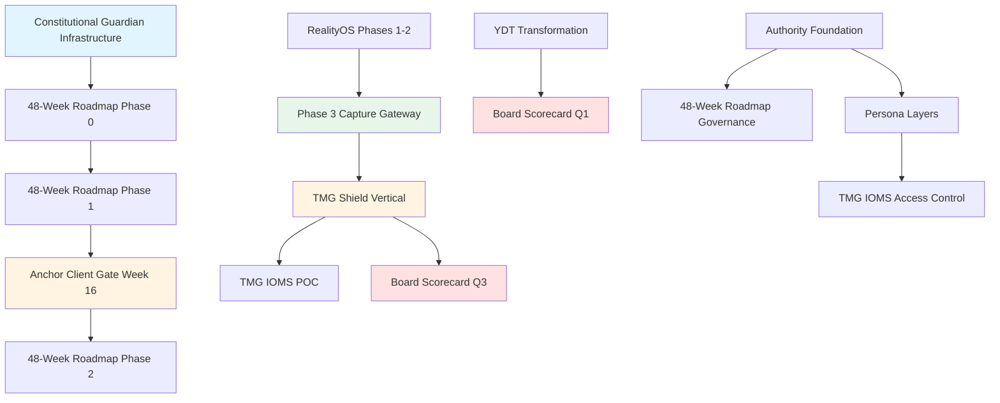

# Unified Plans Strategic Analysis
## Master Documentation: All Strategic Initiatives (2026)

**Date:** January 2026  
**Status:** Strategic Planning Reference + Recent UI/UX Enhancements  
**Recent Updates:** SmartMeasuringInterface reorganization, EngineeringBay enhancements (98-99% UI/UX parity)  
**Purpose:** Single source of truth for all active strategic plans and their relationships  
**Version:** 1.1 (January 2026)

---

## Executive Summary

This document synthesizes **6 major strategic plans** into a unified strategic framework. These plans represent ALMONA's evolution from a window/door fabrication tool to a **governed industrial computing platform** with multi-vertical RealityOS capabilities.

### Plans Analyzed

1. **48-Week National Platform Roadmap** - Curtain walls, facades, skylights extension
2. **2026 Board Scorecard** - Strategic tracking and kill criteria
3. **Phase 3 Reality Capture Gateway** - Constitutional proof validation
4. **TMG IOMS Unified Implementation** - Second vertical (maintenance/operations)
5. **YDT Core Intelligence Transformation** - Intelligence layer transformation
6. **Authority Foundation & Persona Layers** - Authority signals and role-based access

### Strategic Themes

- **Constitutional Governance** - Explicit authority boundaries, enforceable via CI/CD
- **Multi-Vertical Platform** - RealityOS as extraction layer, not single product
- **Intelligence as Moat** - YDT as mandatory intelligence layer, not optional feature
- **National Scale** - Multi-tenant, white-label, government-ready architecture
- **Authority-First** - Human responsibility hooks, immutable audit trails

---

## Plan-by-Plan Analysis

### 1. 48-Week National Platform Roadmap

**Timeline:** 48 weeks (January 2026 - December 2026)  
**Status:** Planning Phase  
**Success Probability:** 65-75% (with anchor client: 80-85%)

#### Strategic Objective

Extend ALMONA from window/door fabrication to curtain walls, facades, skylights, and complex glazing as a national platform with multi-vertical RealityOS capabilities.

#### Key Phases

| Phase | Weeks | Focus | Critical Deliverables |
|-------|-------|-------|---------------------|
| **Phase 0** | 1-4 | Constitutional Foundation | CI/CD enforcement, dashboard, developer onboarding |
| **Phase 1** | 5-16 | Authority-First Foundation | BIM import, curtain wall engine, **anchor client gate** |
| **Phase 2** | 17-28 | Facades & Skylights | Facade engine, skylight engine, complex glazing |
| **Phase 3** | 29-40 | National Platform | Multi-tenancy, white-label, governance & audit |
| **Phase 4** | 41-48 | RealityOS Verticals | Extract 4 verticals, advanced features |

#### Critical Success Factors

1. **Anchor Client Gate (Week 16)** - Hard gate: 3 real projects must pass acceptance
2. **Constitutional Boundaries** - Explicit prohibitions enforced via CI/CD
3. **30% Phase 1 Scope Reduction** - Environmental analysis deferred to Phase 2+
4. **Terminology Freeze (Week 8)** - All public APIs frozen to prevent authority drift

#### Dependencies

- **Requires:** Constitutional Guardian infrastructure (Phase 0)
- **Enables:** RealityOS vertical extraction (Phase 4)
- **Integrates with:** Authority Foundation plan (persona layers)

---

### 2. 2026 Board Scorecard

**Timeline:** Quarterly gates (Q1-Q4 2026)  
**Status:** Planning Phase  
**Purpose:** Executive tracking dashboard with kill criteria

#### Strategic Objective

Create one-page board-ready scorecard tracking strategic vision (YDT transformation, platform proof) and execution reality (performance metrics, revenue targets).

#### Key Metrics

**Strategic Metrics:**
- YDT as mandatory intelligence layer (not just product)
- Multi-vertical platform proof
- Constitutional compliance maintenance
- Irreversibility indicators

**Execution Metrics:**
- YDT performance (P95 latency, availability)
- Revenue targets (tiered model, ARR progression)
- Development velocity (sprint completion, code reuse)
- Resource utilization (founder time allocation)

#### Kill Criteria (Quarterly Gates)

| Quarter | Gate | Kill Condition | Threshold |
|---------|------|----------------|-----------|
| **Q1** | YDT Mandatory | YDT adoption <50% | Technical pivot |
| **Q2** | Revenue Validation | YDT subscribers <50 | Business model pivot |
| **Q3** | Platform Proof | Second vertical not deployed | Platform claim invalid |
| **Q4** | Strategic Position | ARR <$300K | Business model broken |

#### Dependencies

- **Tracks:** 48-Week Roadmap progress (TMG Shield in Q3)
- **Tracks:** YDT Transformation progress (Q1-Q2)
- **Tracks:** Authority Foundation progress (constitutional compliance)

---

### 3. Phase 3 Reality Capture Gateway

**Timeline:** 2 weeks (Week 5-6 of RealityOS Phase 3)  
**Status:** Planning Phase  
**Purpose:** Enforce Principle 1 (Human-Verified Before System-Trusted)

#### Strategic Objective

Build gateway that validates physical reality before events enter immutable Event Ledger. This is the enforcement layer for constitutional Principle 1.

#### Key Components

**Week 5: Core Gateway Implementation**
- QR lifecycle database schema (single-use enforcement)
- QR signature service (HMAC-SHA256, per-vertical keys)
- 5-step QR validator (structural, signature, temporal, single-use, entity binding, revocation)
- Photo validator (max 2 photos, SHA-256, metadata stripping)
- GPS validator (coordinate validation, accuracy threshold, geofence)
- Timestamp validator (no future dates, server-time sync)
- Correlation validator (cross-validator anomaly detection)

**Week 6: Advanced Features**
- Runtime OFF detection (event-only, expectation-based, confidence-scored)
- Fraud detection patterns (QR replay, photo reuse, GPS spoofing, timestamp manipulation)
- Auditor chain walk utilities (integrity verification, provenance tracing)

#### Success Criteria

- ✅ All 5 QR validation steps implemented
- ✅ QR state table enforces single-use
- ✅ Performance: <500ms total validation time
- ✅ Memory: <100MB peak usage
- ✅ All constitutional principles enforced

#### Dependencies

- **Requires:** RealityOS Phases 1-2 complete (cryptographic foundation, event ledger)
- **Enables:** TMG Shield vertical (Phase 6) - needs capture gateway for maintenance verification
- **Integrates with:** 48-Week Roadmap (governance & audit in Phase 3)

---

### 4. TMG IOMS Unified Implementation Plan

**Timeline:** 48 weeks total (8 weeks Phase 6 + 40 weeks TMG IOMS deployment)  
**Status:** Week 11 ~40% complete  
**Purpose:** Second vertical proof (maintenance/operations)

#### Strategic Objective

Unify two parallel tracks:
1. **TMG Shield Vertical** (Phase 6, Weeks 11-18): Technical foundation - RealityOS vertical plugin
2. **TMG IOMS Platform** (POC + Phases 2-4, Weeks 19-58): Business deployment - Complete operational platform

#### Key Phases

**Phase 6: TMG Shield Vertical (Weeks 11-18)**
- Week 11-12: Requirements & Design
- Week 13-14: Rule Implementation (TMGAssetRule, TMGMaintenanceRule, TMGAuditRule)
- Week 15-16: UI & ERP Integration
- Week 17-18: Pilot & Validation
- **Week 18 Gate:** Institutional Safety Gate (5 decision questions, all must be "yes")

**TMG IOMS Phase 1: POC (Weeks 19-24)**
- Week 19-20: POC Setup (Four Seasons San Stefano)
- Week 21-22: POC Execution (daily maintenance verification)
- Week 23-24: POC Validation (Go/No-Go decision)

**TMG IOMS Phases 2-4: Full Deployment (Weeks 25-58)**
- Phase 2: IAM + UIP (Weeks 25-36)
- Phase 3: Full Rollout (Weeks 37-50)
- Phase 4: Optimization (Weeks 51-58)

#### Critical Success Factors

1. **Week 18 Institutional Safety Gate** - All 5 questions must be "yes" before POC
2. **Week 14 Interface Freeze** - TMG Shield rule interfaces frozen (v1.0)
3. **Constitutional Compliance** - All rules must pass 100% compliance checks
4. **Performance Targets** - Event validation <100ms, rule lookup <10ms

#### Dependencies

- **Requires:** RealityOS Phases 1-5 complete (core platform operational)
- **Requires:** Phase 3 Reality Capture Gateway (QR validation for maintenance)
- **Enables:** Board Scorecard Q3 gate (platform multi-vertical proof)
- **Integrates with:** 48-Week Roadmap (governance infrastructure in Phase 3)

---

### 5. YDT Core Intelligence Transformation

**Timeline:** 8 weeks (Weeks 1-8)  
**Status:** Planning Phase  
**Purpose:** Transform YDT from isolated chatbot to central intelligence engine

#### Strategic Objective

Transform YDT from "45% complete chatbot feature" to "100% complete intelligence platform that powers everything." YDT becomes the nuclear weapon - proprietary Egyptian/Algerian/UAE market intelligence.

#### Key Phases

**Phase 0: Quick Start (Week 1, Days 1-3)**
- Parse existing documentation (README, plans, architecture)
- Create DocumentationKnowledgeGraph
- Create QuickStartYDT (knows YOUR system)
- Create FabricatorExpert (expert persona)

**Phase 1: Foundation (Week 1, Days 4-7)**
- Create YDTCoreService (singleton, TypeScript)
- Create YDT Backend API (Python)
- Create EgyptianFabricationIntelligence (hard-coded market data)

**Phase 2: Integration (Weeks 2-3)**
- Create YDTPricingOracle (replace static pricing)
- Inject YDT into optimization (YDTOptimizationWrapper)
- Create YDTBusinessLayer (orchestration layer)
- Integrate into FabricatorWorkflow

**Phase 3: IP Protection & Analytics (Weeks 4-5)**
- Create YDT encryption service (watermarking)
- Create YDT analytics dashboard
- Create YDT impact analyzer

**Phase 4: Productization (Weeks 6-8)**
- Create YDT Intelligence Reports page (standalone product)
- Create YDT API for partners
- Create competitive intelligence tracker

#### Critical Success Factors

1. **YDT Mandatory Enforcement** - Not optional chatbot, required intelligence layer
2. **Documentation-First** - Parse YOUR docs before machine manuals
3. **Business Integration** - Powers pricing, optimization, presets, validation
4. **IP Protection** - Encryption, watermarking, audit trails

#### Dependencies

- **Enables:** Board Scorecard Q1 gate (YDT mandatory established)
- **Integrates with:** 48-Week Roadmap (Tier 1 Authoritative AI)
- **Integrates with:** Authority Foundation (decision justification)

---

### 6. Authority Foundation & Persona Layers

**Timeline:** 8 weeks (Weeks 1-8)  
**Status:** Planning Phase  
**Purpose:** Authority signals and role-based access control

#### Strategic Objective

Implement 8-week phased approach: Weeks 1-4 establish authority signals (visible to all users), Weeks 5-8 add persona-specific layers (role-based UI adaptations).

#### Key Phases

**Phase A: Authority Foundation (Weeks 1-4)**
- Week 1: Operation Mode Badge + AuthorityContext
- Week 2: Consequence Engine (real-world impact warnings)
- Week 3: Output Clarity (visual vs production accuracy)
- Week 4: Decision Justification (system-verified recommendations)

**Phase B: Persona Layers (Weeks 5-8)**
- Week 5: Persona Detection Foundation (role mapping)
- Week 6: Persona Context Layer (UI adaptations)
- Week 7: Tab Filtering + Redirect Banner
- Week 8: Feature Gating (permission enforcement)

#### Critical Success Factors

1. **AuthorityContext** - Single source of truth (prevents drift)
2. **ACCURACY_CONTRACT** - Frozen values (prevents inflation)
3. **Persona Resolution Caching** - Explicit invalidation triggers
4. **Write Enforcement** - guardedMutation() wrapper (non-bypassable)

#### Dependencies

- **Enables:** 48-Week Roadmap (constitutional boundaries)
- **Integrates with:** YDT Transformation (decision justification)
- **Integrates with:** TMG IOMS (persona-based access control)

---

## Strategic Relationships & Dependencies

### Dependency Graph

### Critical Path Analysis

**Path 1: Constitutional Foundation → National Platform**
1. Constitutional Guardian Infrastructure (Week 1-4)
2. BIM Import Engine (Week 5-8)
3. Curtain Wall Engine (Week 9-12)
4. Anchor Client Gate (Week 16) - **HARD GATE**
5. Quotation Engine (Week 17-20)
6. National Platform Infrastructure (Week 29-40)
7. RealityOS Extraction (Week 41-44)

**Path 2: RealityOS Core → TMG Vertical**
1. RealityOS Phases 1-2 (Cryptographic Foundation, Event Ledger)
2. Phase 3 Capture Gateway (Week 5-6)
3. TMG Shield Vertical (Week 11-18)
4. Week 18 Institutional Safety Gate - **HARD GATE**
5. TMG IOMS POC (Week 19-24)
6. Board Scorecard Q3 Gate - **Platform Proof**

**Path 3: YDT Transformation → Intelligence Moat**
1. YDT Documentation Parsing (Week 1, Days 1-3)
2. YDT Core Service (Week 1, Days 4-7)
3. YDT Business Integration (Week 2-3)
4. YDT Mandatory Enforcement (Board Scorecard Q1)
5. YDT Productization (Week 6-8)

**Path 4: Authority Foundation → Governance**
1. Authority Signals (Week 1-4)
2. Persona Detection (Week 5)
3. Persona Layers (Week 6-8)
4. Integration with 48-Week Roadmap Governance (Week 37-40)

---

## Timeline Integration

### 2026 Quarterly View

| Quarter | 48-Week Roadmap | Board Scorecard | TMG IOMS | YDT | Authority |
|---------|----------------|-----------------|----------|-----|-----------|
| **Q1** | Phase 0-1 (Constitutional + BIM) | YDT Mandatory Gate | Phase 6 Prep | Transformation | Foundation |
| **Q2** | Phase 1-2 (Curtain Wall + Facades) | Revenue Validation | Phase 6 Dev | Integration | Persona Layers |
| **Q3** | Phase 2-3 (Skylights + Platform) | Platform Proof Gate | TMG POC | Productization | Complete |
| **Q4** | Phase 3-4 (Governance + Verticals) | Strategic Position | TMG Phase 2 | Complete | Complete |

### Critical Gates (Must-Pass)

1. **Week 8:** Terminology Freeze (48-Week Roadmap)
2. **Week 16:** Anchor Client Gate (48-Week Roadmap) - **HARD GATE**
3. **Week 18:** TMG Institutional Safety Gate (TMG IOMS) - **HARD GATE**
4. **Q1 End:** YDT Mandatory Established (Board Scorecard)
5. **Q2 End:** Revenue Model Validated (Board Scorecard)
6. **Q3 End:** Platform Multi-Vertical Proven (Board Scorecard) - **HARD GATE**
7. **Q4 End:** Strategic Position Achieved (Board Scorecard)

---

## Integration Points

### 1. Constitutional Governance (Cross-Plan)

**Shared Components:**
- Constitutional Guardian Infrastructure (48-Week Roadmap Phase 0)
- Authority Foundation (Authority Plan Weeks 1-4)
- Constitutional Compliance (TMG Shield Week 14)
- Governance Dashboard (48-Week Roadmap Phase 3)

**Integration:**
- All plans must respect NOT IN SCOPE 2026 prohibitions
- All plans must pass constitutional validation (CI/CD)
- All plans must maintain Tier 3 purity (99.8%+ accuracy, zero AI)

### 2. RealityOS Platform (Cross-Plan)

**Shared Components:**
- RealityOS Core (Phases 1-5 complete)
- Phase 3 Capture Gateway (QR validation)
- Vertical Registry (TMG Shield registration)
- Event Ledger (immutable audit trail)

**Integration:**
- 48-Week Roadmap extracts verticals in Phase 4
- TMG Shield registers as second vertical (Week 14)
- Board Scorecard tracks platform proof (Q3)

### 3. Intelligence Layer (Cross-Plan)

**Shared Components:**
- YDTCoreService (YDT Transformation)
- YDTBusinessLayer (orchestration)
- Decision Justification (Authority Plan Week 4)
- Tier 1 Authoritative AI (48-Week Roadmap)

**Integration:**
- YDT powers Tier 1 suggestions (48-Week Roadmap)
- YDT provides decision justification (Authority Plan)
- YDT mandatory enforcement (Board Scorecard Q1)

### 4. Authority & Access Control (Cross-Plan)

**Shared Components:**
- AuthorityContext (Authority Plan Week 1)
- Persona Detection (Authority Plan Week 5)
- Persona Layers (Authority Plan Week 6-8)
- Human Responsibility Hooks (48-Week Roadmap Phase 3)

**Integration:**
- Persona-based access control (TMG IOMS)
- Authority signals in all workflows (48-Week Roadmap)
- Human approval workflows (quotation engine)

---

## Potential Conflicts & Resolutions

### Conflict 1: Timeline Overlap

**Issue:** Multiple plans have overlapping timelines (Q1-Q2)

**Resolution:**
- **Sequential Focus:** Authority Foundation (Weeks 1-8) → YDT Transformation (Weeks 1-8) → 48-Week Roadmap (Weeks 1-48)
- **Parallel Execution:** Constitutional Guardian (Week 1-4) can run parallel with Authority Foundation (Week 1-4)
- **Resource Allocation:** Founder-led team requires sequential focus, not parallel execution

### Conflict 2: Resource Competition

**Issue:** TMG IOMS (Week 11-18) overlaps with 48-Week Roadmap Phase 1 (Week 5-16)

**Resolution:**
- **TMG IOMS is Second Vertical:** Proves platform capability (Board Scorecard Q3)
- **48-Week Roadmap is National Platform:** Extends ALMONA to new domains
- **Different Teams:** TMG IOMS can be separate team/contractor, 48-Week Roadmap is core team
- **Priority:** TMG IOMS is Q3 gate requirement, 48-Week Roadmap is 12-month commitment

### Conflict 3: Constitutional Boundaries

**Issue:** All plans must respect constitutional boundaries, but scope may drift

**Resolution:**
- **Constitutional Guardian Infrastructure (Week 1-4):** Hard enforcement via CI/CD
- **NOT IN SCOPE 2026:** Explicit prohibitions documented
- **Terminology Freeze (Week 8):** Prevents language drift
- **Constitutional Tests:** All plans must pass validation

### Conflict 4: YDT Mandatory vs Optional

**Issue:** YDT Transformation makes YDT mandatory, but current state is optional

**Resolution:**
- **Board Scorecard Q1 Gate:** YDT mandatory established (hard requirement)
- **YDT Transformation Plan:** 8-week transformation to mandatory layer
- **Integration Points:** YDT powers Tier 1 (48-Week Roadmap), decision justification (Authority Plan)
- **Timeline:** YDT Transformation (Weeks 1-8) completes before Board Scorecard Q1 gate

---

## Success Metrics (Unified)

### Strategic Metrics (Board Scorecard)

| Metric | Target | Measurement | Plan |
|--------|--------|-------------|------|
| **YDT Mandatory** | 100% adoption | Usage tracking | YDT Transformation |
| **Platform Multi-Vertical** | 2+ verticals | Vertical registry | TMG IOMS |
| **Constitutional Compliance** | 100% | Dashboard monitoring | All Plans |
| **National Platform Ready** | Multi-tenant operational | Infrastructure tests | 48-Week Roadmap |

### Execution Metrics (Board Scorecard)

| Metric | Target | Measurement | Plan |
|--------|--------|-------------|------|
| **YDT Performance** | P95 <2s, 99.9% uptime | Monitoring | YDT Transformation |
| **Revenue (ARR)** | $500K (conservative) | Financial tracking | All Plans |
| **Development Velocity** | Sprint completion >90% | Sprint tracking | All Plans |
| **Code Reuse** | ≥90% (TMG Shield) | Code analysis | TMG IOMS |

### Technical Metrics (48-Week Roadmap)

| Metric | Target | Measurement | Plan |
|--------|--------|-------------|------|
| **Constitutional Health** | >90/100 | Dashboard | 48-Week Roadmap |
| **Tier 3 Purity** | 100% | CI/CD validation | All Plans |
| **BIM Import Success** | >95% | Integration tests | 48-Week Roadmap |
| **BOM Accuracy** | >99% | Manual validation | 48-Week Roadmap |

### Business Metrics (48-Week Roadmap)

| Metric | Target | Measurement | Plan |
|--------|--------|-------------|------|
| **Enterprise Clients** | 20-30 Year 1 | CRM tracking | 48-Week Roadmap |
| **National Licenses** | 1-2 Year 1 | Contract tracking | 48-Week Roadmap |
| **Anchor Client** | Week 16 acceptance | Acceptance certificate | 48-Week Roadmap |
| **TMG POC Success** | Week 24 Go/No-Go | POC validation | TMG IOMS |

---

## Risk Mitigation (Unified)

### Risk 1: Timeline Compression

**Mitigation:**
- 30% Phase 1 scope reduction (48-Week Roadmap)
- Sequential focus, not parallel execution
- Internal 18-month buffer (Board Scorecard)
- Anchor client gate prevents scope creep

### Risk 2: Authority Boundary Violation

**Mitigation:**
- Constitutional Guardian Infrastructure (Week 1-4)
- CI/CD enforcement (can't merge prohibited code)
- Constitutional tests (all plans)
- Terminology freeze (Week 8)

### Risk 3: Resource Constraints

**Mitigation:**
- Realistic targets (20-30 clients, not 40-60)
- Founder-led execution (1-3 person team)
- Sequential focus (prove value, then scale)
- Kill criteria (Board Scorecard quarterly gates)

### Risk 4: Platform Proof Failure

**Mitigation:**
- TMG Shield as second vertical (Q3 gate)
- Week 18 Institutional Safety Gate (TMG IOMS)
- 90% code reuse requirement (TMG Shield)
- Platform extraction in Phase 4 (48-Week Roadmap)

---

## Recommendations

### Priority Order (Execution Sequence)

1. **Week 1-4: Constitutional Foundation** (48-Week Roadmap Phase 0 + Authority Foundation Weeks 1-4)
   - Deploy Constitutional Guardian infrastructure
   - Establish authority signals
   - Create NOT IN SCOPE 2026 document

2. **Week 1-8: YDT Transformation** (Parallel with Constitutional Foundation)
   - Transform YDT to mandatory intelligence layer
   - Integrate into business workflows
   - Meet Board Scorecard Q1 gate

3. **Week 5-16: 48-Week Roadmap Phase 1** (After Constitutional Foundation)
   - Build BIM import engine
   - Build curtain wall engine
   - Secure anchor client acceptance (Week 16 gate)

4. **Week 11-18: TMG Shield Vertical** (Parallel with 48-Week Roadmap Phase 2)
   - Build TMG Shield as second vertical
   - Pass Week 18 Institutional Safety Gate
   - Meet Board Scorecard Q3 gate

5. **Week 17-48: 48-Week Roadmap Phases 2-4** (After Phase 1)
   - Build quotation engine
   - Build national platform infrastructure
   - Extract RealityOS verticals

6. **Week 19-58: TMG IOMS Deployment** (After TMG Shield)
   - Execute POC (Week 19-24)
   - Deploy full platform (Week 25-58)

### Critical Success Factors (All Plans)

1. **Constitutional Boundaries Enforced** - CI/CD, tests, dashboard
2. **Anchor Client Gate Passed** - Week 16 (48-Week Roadmap)
3. **YDT Mandatory Established** - Q1 (Board Scorecard)
4. **Platform Multi-Vertical Proven** - Q3 (Board Scorecard)
5. **TMG Institutional Safety Gate** - Week 18 (TMG IOMS)

---

## Conclusion

These 6 plans represent a **coherent strategic evolution** from product to platform:

1. **Constitutional Foundation** (Authority + Guardian) → Governance infrastructure
2. **Intelligence Layer** (YDT Transformation) → Competitive moat
3. **Platform Extension** (48-Week Roadmap) → National scale
4. **Second Vertical** (TMG IOMS) → Platform proof
5. **RealityOS Extraction** (Phase 4) → Multi-vertical capability

**The unified strategy:**
- **YDT is the moat** (proprietary intelligence)
- **RealityOS is the platform** (constitutional truth infrastructure)
- **ALMONA is the first vertical** (window/door fabrication)
- **TMG Shield is the second vertical** (maintenance/operations)
- **Constitutional boundaries are the defense** (legal, enterprise, government)

**Success requires:**
- Discipline (kill criteria, gates, scope control)
- Governance (constitutional boundaries, audit trails)
- Execution (sequential focus, realistic targets)
- Validation (anchor client, TMG POC, platform proof)

---

**Document Status:** ✅ Strategic Reference + Recent UI/UX Enhancements  
**Recent Updates (January 2026):**
- ✅ EngineeringBay: 98-99% UI/UX parity (exceeds gold-tier target)
- ✅ SmartMeasuringInterface: Layout reorganization (system pack at top, SmartDraw below)
- ✅ Visual Polish: Prestige theme consistency
- ✅ Performance: Optimization complete

**Next Review:** After Week 16 (Anchor Client Gate)  
**Authority:** Master Planning Document

