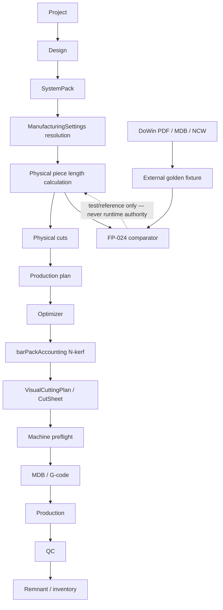

# FP-024A — External DoWin Golden Parity (9 September 2026)

| Field | Value |
|-------|--------|
| Date | 9 September 2026 |
| Repository | `almona-portfolio-forge` |
| Branch | `feature/fp024-dowin-external-golden` |
| Depends on | FP-023A (settings contract), FP-023B (canonical kerf identity) |
| Scope | Ingest licensed asdd export; three-layer length semantics; per-piece ±0.1 mm gate. Not FP-016, FP-017, column generation, or a DoWin UI clone. |
| Fixture | `dowin-deceuninck70z-asdd-1000x1500-20260909` (`deceuninck70-asdd-1000x1500-dowin-2026-09-09`) |
| Gate | ❌ **NOT ACCEPTED** |
| Physical-length score | **Unchanged at 6.0/10** |

External-fixture availability is **unblocked**. Physical-length parity is **not proven**. Ready-to-execute is not a pass.

---

## Verdict

❌ **NOT ACCEPTED**

The licensed DoWin job is now a real fixture. Represented categories (frame, sash, mullion, glazing bead) all **FAIL** against ALMONA actuals. Glass remains **UNPROVEN** (`PENDING_EXTERNAL_FIXTURE`). Angle compensation remains **UNPROVEN** / `NOT_APPLICABLE`. `dowinParityGatePasses` is **false**. FP-023A/B were not rewritten to chase DoWin remainders.

---

## Forensic inventory (canonical modules reused)

| Module | Path | Evidence |
|--------|------|----------|
| ManufacturingSettings | `src/lib/fabricator/ManufacturingSettings.ts` | `resolveManufacturingSettings` L186; `freezeManufacturingSettings` L281; remnant 300 platform / 500 `yilmazcad-parity` |
| barPackAccounting | `src/lib/fabricator/barPackAccounting.ts` | `accountBarPack` L85; N kerfs (`kerf_after_each_piece`) |
| LinearOptimizer | `src/lib/algorithms/LinearOptimizer.ts` | `pieceSlotMm` L13 / L82 |
| BatchOptimizationService | `src/lib/fabricator/production/BatchOptimizationService.ts` | `settings.sawKerfMm` L106–108 |
| AlmonaCuttingEngine | `src/lib/fabricator/AlmonaCuttingEngine.ts` | `resolveManufacturingSettings` L20 / L199; `pieceSlotMm` L344 |
| UPVCCuttingEngine | `src/lib/fabricator/UPVCCuttingEngine.ts` | `calculateKFactor` L58; **not** wired to `DowinParityLengthEngine` |
| Apex packing | `src/lib/fabricator/goldTier/ApexEngineV6.ts` | `optimizeLinearCuts(..., settings.sawKerfMm)` L305–306 |
| VisualCuttingPlan | `src/components/fabricator/VisualCuttingPlan.tsx` | `barConsumedLengthMm` + `isReusableRemnantLength` (resolved threshold, not 500 hard-coded) |
| CutListViewer | `src/components/fabricator/CutListViewer.tsx` | `PLATFORM_MANUFACTURING_DEFAULTS` L19 |
| CutSheetGenerator | `src/lib/fabricator/production/CutSheetGenerator.ts` | `resolveManufacturingSettings` L59 / L121; optional nominal/packed columns |
| Cut-list export | `src/lib/fabricator/CutListExport.ts` | CSV/PDF; historical `length` |
| SystemPack geometry | `src/types/fenestration.ts` | `fabricationRules.cutting` L143–175 (microns; Basma/Kaynak not per-profile) |
| RemnantManager | `src/lib/inventory/RemnantManager.ts` | `PLATFORM_MANUFACTURING_DEFAULTS` L16–19 |
| YilmazCutListAdapter | `src/integrations/yilmaz/YilmazCutListAdapter.ts` | CSV/MDB L11–18; **no NCW** |
| YilmazGCodeGenerator | `src/integrations/yilmaz/YilmazGCodeGenerator.ts` | AIM/ALM/PIM G-code L10–16 |
| NCW | — | **Not implemented.** Preflight reports unsupported. |
| FP-024 fixture | `src/lib/fabricator/golden/dowinPhysicalLengthFixture.ts` | this audit |
| FP-023A/B audits | `docs/audits/FP-023A-MANUFACTURING-SETTINGS-CONTRACT_2026-09-09.md`, `docs/audits/FP-023B-KERF-ACCOUNTING_2026-09-09.md` | unchanged identity |
| Design workspace | `src/components/fabricator/drafting/DraftingWorkbench.tsx` | existing three-pane Studio |
| Production / optimization UI | `ProjectOptimizer.tsx`, `CuttingOptimizationEngine.tsx` | mixed planning/optimization; DoWin four-region cockpit **not** built |
| Playwright | `playwright.config.ts`, `tests/e2e/` | exists; Design/Production/Optimization visual-diff **not** captured (workbench hierarchy not implemented) |

FP-023A ⚠️ CONDITIONAL and FP-023B ✅ PROVEN (internal N-kerf identity) remain the accepted program state.

---

## External fixture provenance

Licensed dealer/user exports (PDFs/MDB **not** committed; SHA-256 only):

| File | SHA-256 |
|------|---------|
| `OptimizationReport_20260909_181432.pdf` | `e9ce43f736bbe40d037f29100e58d13c9b6f7febc611f51ac6f3a26a1f012ca0` |
| `OptimizationReport_20260909_181432_Labels.pdf` | `d84ba781136a3859980d10866e267c13fe5ad942663df77e76709c6d9c7d05fe` |
| `OptimizationReport_20260909_181432_DesignPreview.pdf` | `f6a00ef01eba45336e1557abd5dcceefbe14bdb70c55f7443a705afd8d9c64b0` |
| `asdasd_2026.09.09_18.15.mdb` | `6d5932947327db0272e5de92de4d47e4320ecb1aeadbc6a268f2bbd383a3f82d` |

Job: order **10001**, design **asdd**, Deceuninck 70 PVC, 1000 × 1500 mm, quantity 1, 21 physical profile pieces.

This-run `jobSettings` (unknown fields stay **null**; no factory-default fill):

| Field | Value |
|------|--------|
| sawThicknessMm | null |
| weldingWasteMm | null |
| sashOffsetMm | null |
| trimCutMm | null |
| remnantThresholdMm | null |
| machineId | `DC-600` (MDB evidence) |

Dealer-audit Basma/Kaynak/SashOffset numbers live in `referenceSettings` for **formula tracing only**. They are not this-run Settings authority and are not copied into execution.

---

## Three length layers

| Layer | Fixture field | asdd frame H | asdd sash H | asdd mullion | asdd bead H |
|-------|---------------|-------------:|------------:|-------------:|------------:|
| Nominal / report | `expectedNominalLengthMm` | 1000 | 451 | 1416 | 331 |
| Packed / graphic | `expectedPackedSegmentMm` | 1003 | 454 | 1416 | 334 |
| Machine (MDB) | `expectedMachineLengthMm` | 1003 | 454 | 1416 | **null** |

Beads are absent from the DC-600 `Table1` (13 profile rows = 4 frame + 8 sash + 1 mullion). `expectedMachineLengthMm` is therefore **null** on all eight beads. The repository must not set machine = packed without that evidence. `dowinMachineParityPasses` is false when expected is null.

Observed 45° delta is **+3 mm** (nominal vs packed). 90° mullion is unchanged. That is consistent with WeldingWaste in the dealer audit, but this job does not print Settings.WeldingWaste, so the field stays null.

---

## Physical pieces (21)

Assembly labels are external IDs, not array indexes.

| Category | Profile | Qty | Nominal | Packed | Machine | Angles |
|----------|---------|----:|--------:|-------:|--------:|--------|
| frame_horizontal | Deceuninck-KASA-70 | 2 | 1000 | 1003 | 1003 | 45/45 |
| frame_vertical | Deceuninck-KASA-70 | 2 | 1500 | 1503 | 1503 | 45/45 |
| sash_horizontal | Deceuninck-KANAT-70 | 4 | 451 | 454 | 454 | 45/45 |
| sash_vertical | Deceuninck-KANAT-70 | 4 | 1430 | 1433 | 1433 | 45/45 |
| mullion | Deceuninck-ORTA-KAYIT-70 | 1 | 1416 | 1416 | 1416 | 90/90 |
| glazing_bead_horizontal | Deceuninck-CITA-20 | 4 | 331 | 334 | null | 45/45 |
| glazing_bead_vertical | Deceuninck-CITA-20 | 4 | 1310 | 1313 | null | 45/45 |

---

## Category scorecard

| Category | Availability | Gate | ALMONA actual | Notes |
|----------|-------------|------|---------------|-------|
| frame_horizontal | READY | **FAIL** | none | Unevidenced frame formula |
| frame_vertical | READY | **FAIL** | none | Unevidenced frame formula |
| sash_horizontal | READY | **FAIL** | packed 444 vs 454 | See formula trace |
| sash_vertical | READY | **FAIL** | packed 1427 vs 1433 | See formula trace |
| mullion | READY | **FAIL** | none | Unevidenced full formula |
| glazing_bead_horizontal | READY | **FAIL** | none | Unevidenced bead formula |
| glazing_bead_vertical | READY | **FAIL** | none | Unevidenced bead formula |
| glass | PENDING_EXTERNAL_FIXTURE | **UNPROVEN** | not scored | Canvas 329×1308 is not a production dimension |
| angle_compensation | NOT_APPLICABLE | **UNPROVEN** | not scored | Job only 45°/90° |

Per-piece rule: one piece with `abs(actual − expected) > 0.1` fails the category. No averaging. Missing actual against a non-null expected is a fail.

---

## Formula discrepancy analysis

Isolated `DowinParityLengthEngine` (not production `UPVCCuttingEngine`) using sash-outer **437 × 1416** from the design property panel:

| Term | Documented expression | Result | DoWin packed | Adopted? |
|-------|------------------------|-------:|-------------:|----------|
| sash inner W | 437 − 2×7 | 423 | — | tracing only |
| sash H | inner + 12 + 6 + 3 | **444** | 454 | **No** (−10 mm) |
| sash V | inner + 16 + 6 + 3 | **1427** | 1433 | **No** (−6 mm) |
| outer+2×SashOffset+weld | 437+14+3 | 454 | 454 | **No** — conflicts with documented inner+Basma+Kaynak+weld |
| frame packed | overall + 3 | 1003/1503 | 1003/1503 | **No** — one-job observation; frame Basma/Kaynak null in seed |
| mullion | sash outer height | 1416 | 1416 | **No** — coincidence until named term exists |
| glass via inner−2×2.5 | 418 / 1397 | vs canvas 329/1308 | **No** — ~54 mm/side rebate unevidenced |

Class: sash packed miss is `UNEVIDENCED_FORMULA` (documented Basma/Kaynak path does not reproduce 454). Frame/bead/mullion remain `UNEVIDENCED_FORMULA`. `calculateKFactor` stays on the legacy UPVC path and is not deleted.

**STOP:** no production formula was changed to make the fixture green.

---

## Bar-plan comparison (diagnostic)

Canonical FP-023B: N × 4 mm kerf, trim 0. External remainders are **not** used to rewrite `barPackAccounting`.

| Pattern | Stock | Packed labels | DoWin remaining | Unexplained after N×kerf |
|---------|------:|---------------|----------------:|--------------------------:|
| KASA-70 | 6000 | 1503×2 + 1003×2 | 965 | **7 mm** UNRECONCILED |
| KANAT-70 ×2 | 6000 | 1433×2 + 454×2 | 2203 | **7 mm** UNRECONCILED |
| ORTA-KAYIT-70 | 6500 | 1416 | 5080 | **0** RECONCILED |
| CITA-20 A | 6500 | 1313×4 + 334×3 | 206 | UNRECONCILED |
| CITA-20 B | 6500 | 334 | 6160 | UNRECONCILED |

Nesting order is **not** a pass criterion. Physically impossible fit is rejected by internal accounting (mullion 1416 + 4 kerf = 1420; 6500−1420=5080).

---

## Data flow



---

## UI / reports checkpoint

DoWin information architecture is documented in `docs/audits/DOWIN_UI_REFERENCE_ANNOTATIONS_2026-09-09.md` (text/diagrams only; no copyrighted screenshots).

Implemented in this slice (ALMONA identity, not a pixel clone):

- Three-layer CutSheet optional columns (`nominalLengthMm`, `packedSegmentMm`, `machineInstructionLengthMm`)
- `ManufacturingSettingsProvenancePanel` renders `manufacturingSettingsProvenanceRows` from the same resolved object
- VisualCuttingPlan remaining region uses `isReusableRemnantLength` (platform 300 / parity 500 via props, not a 500 literal)
- Machine-export preflight blocks unplaced cuts and reports NCW as unsupported

Not implemented (STOP — parity still fails; do not hide it with a cockpit):

- Four-region Production workspace
- Optimization KPI + required-parts + stock + unplaced + bar visualizer shell
- Playwright before/after visual diffs for Design / Production / Optimization
- NCW encoder
- Full shop PDF suite (design preview / assembly labels / optimization summary)

---

## Remaining external-evidence gaps

1. This-run Settings print (saw thickness, weld, sash offset, trim, remnant floor).
2. Glass production dimension (not canvas daylight).
3. Non-square angle compensation job.
4. Glazing-bead machine instruction (not in DC-600 MDB).
5. Physical meaning of the extra 7 mm on KASA/KANAT bars.
6. Authoritative mapping of 1000 vs 1003 (weld vs pack vs display) beyond the three-layer split.

---

## Legal / IP

Allowed evidence used: licensed manual (behaviour), legitimate PDFs, legitimate MDB millimetres, dealer-audit documented settings, independently implemented ALMONA code.

Not done: no binary decompilation, no SQLCipher/DPAPI, no Eyeshot/artwork copy, no pixel-identical DoWin clone, no licensed binaries or encrypted shop DBs committed.

External golden values are **test/reference input only**. They are not runtime manufacturing authority.

---

## Tests

Commands (9 Sep 2026, this branch):

```bash
npm run type-check
npm run build
npx vitest run src/tests/fabricator
npx vitest run src/tests/constitutional
npx vitest run src/tests/fabricator -t "FP-024|DoWin|parity"
npx vitest run src/tests/fabricator/kerfAccountingInvariant.test.ts
```

| Command | Result |
|---------|--------|
| `npm run type-check` | exit 0 |
| `npm run build` | exit 0 (`vite build` 40.88s) |
| `npx vitest run src/tests/fabricator` | 5 files, 77 tests, 0 failed |
| `npx vitest run src/tests/constitutional` | 8 files, 83 tests, 0 failed |
| `npx vitest run src/tests/fabricator -t "FP-024\|DoWin|parity"` | 25 passed, 52 skipped (filter) |
| FP-023B `kerfAccountingInvariant` | green (N-kerf identity) |

Pass conditions for this checkpoint: type-check/build exit 0; fabricator and constitutional **0 failures**; FP-023A/B green; FP-024 gate **false**; glass/angle not PASS; machine-null does not pass machine parity.

---

## Scores (unchanged)

| Area | Score |
|------|------:|
| Manufacturing settings governance | 8.0/10 |
| Physical-length correctness | **6.0/10** |
| Optimization correctness | 7.0/10 |
| CAD/CAM confidence | 5.5–6.0/10 |
| Industrial core | ~7.2–7.4/10 |

A score increase requires represented categories ≤ 0.1 mm. Fixture ingestion alone does not raise the score.
