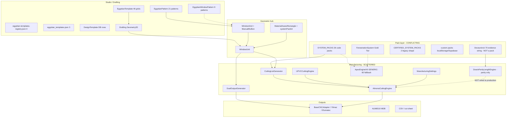

# Regional Profile + Blueprint Scalability Audit

| Field | Value |
|-------|--------|
| Date | 13 September 2026 |
| Mode | FORENSIC REPOSITORY AUDIT ONLY |
| Branch | `feature/fp024c-physical-parity` |
| HEAD | `4c5e1749aeb6861bf6eab10bfbd7fa58db8c6f9d` (`4c5e174`) |
| Latest known checkpoint | `4c5e174` — match; no reset performed |
| PR #32 | Draft / **DO NOT MERGE** |
| FP-024C | **COMPLETE** for bounded Deceuninck 70 parity scope |
| Physical-length correctness | **7.5/10** — unchanged by this audit |
| GENERALIZED_MANUFACTURING_FORMULA | **UNPROVEN** — unchanged |
| FP-027 | **OPEN** / root cause **UNPROVEN** — unchanged |
| Protected production | Zero functional diff intended in `src/lib/fabricator/production/**`, cutting engines, OptimizationEngine, barPackAccounting, ManufacturingSettings, DowinParityLengthEngine, canonical Cut, CNC runtime |

Inventory script (audit-only, not runtime): `scripts/audit/inventory-regional-profile-blueprint.mjs`

---

## 1. Executive verdict

**Can ALMONA evolve into one canonical geometry/template library × many aluminium/UPVC system packs × regional variants × deterministic manufacturing rule packs × machine adapters, without duplicating drawing logic or sacrificing Tier-3 authority?**

```
YES — BUT REQUIRES A CONTROLLED ARCHITECTURAL REFACTOR
```

The repository already contains most of the *names* of the target architecture. It does **not** yet contain a single fail-closed binding between those names.

What is already reusable:

- `WindowUnit` + `WindowGrid` is the production geometric hub.
- `SystemPack` is the production pack type (code-bundled, with a DB shadow).
- `Profile.profileRole` is a real semantic-role union.
- `EgyptianPattern.compatibleSystems` is a real (stale) compatibility list.
- `ManufacturingSettings` already has a `systemPack` override slot.
- `DualOutputGenerator` already *intends* visual DNA vs production DNA.
- `BaseCNCAdapter` already *intends* cuts → machine mapping.

What blocks scale:

- At least **six semantically different template/blueprint mechanisms** coexist.
- `FenestrationSystem` (Gold Tier) and `SystemPack` (production) are **not the same type**.
- Deceuninck 70 — the only forensically proven physical-length system — is **not** a `SYSTEM_PACKS` identity.
- Manufacturing formulas are scattered across engines, hardcoded pack JSON, and a parity adapter that production does not consume.
- Geometry stores **mixed** millimetres and ratios; some geometry objects embed `systemPackId`.
- Unvalidated packs are selectable. Gold Tier adaptation silently invents `GENERIC-60` aluminium defaults and never reads `pack.profiles` (`ApexEngineV6.ts:82-111`).
- A missing project `systemPackId` is persisted as `'rock60'` (`ProjectPersistenceService.ts:203,557`). That is silent identity mutation, not fail-closed.
- There is no pack/template version snapshot that would keep a manufactured project frozen.

This is not a greenfield rewrite. It is a contract-unification refactor **above** the locked production formula layer. Do not reopen FP-024C. Do not generalize the manufacturing formula as part of onboarding.

---

## 2. Current architecture diagram



**STATUS: PROVEN** that the intended flow (blueprint → geometry → system pack → cuts → rules → optimize → machine) is *described* in `DualOutputGenerator` comments (`src/lib/fabricator/DualOutputGenerator.ts:8-11`) and *not* implemented as a single authority path.

---

## 3. Current repository component inventory

Machine-checked 13 Sep 2026 via `node scripts/audit/inventory-regional-profile-blueprint.mjs`.

| Layer | What exists | Count | Status |
|-------|-------------|-------|--------|
| EgyptianTemplate | `egyptianTemplates.ts` grid templates | **46 unique IDs** (file comment claims 50+) | CONFLICTING claim vs count |
| EgyptianPattern | `EGYPTIAN_PATTERNS` | **21** | PROVEN |
| EgyptianWindowPattern | `EGYPTIAN_WINDOW_PATTERNS` in the same file | **9** | PROVEN; overlapping id `kitchen-door-acp` |
| JSON registry | `egyptian-templates-registry.json` | **4** | PROVEN |
| JSON topology | `egyptian_templates.json` | **3** | PROVEN |
| Project templates | `PROJECT_TEMPLATES` | **3 objects** (`res-standard-casement`, `res-sliding-2track`, `com-curtain-wall-basic`). Only `rock60` is a shipped pack id. `s700` and `f50` are unresolved comments. | PROVEN |
| SYSTEM_PACKS | code array + UPVC spread | **26** (13 aluminium/named + 13 Egyptian UPVC) | PROVEN |
| Certified packs | `CERTIFIED_SYSTEM_PACKS` | **2** (different schema) | PROVEN |
| Deceuninck pack | — | **0** in `SYSTEM_PACKS` | PROVEN ABSENT |
| UPVC Profile[] ids | `upvc-systems.ts` | **67** | PROVEN |
| Aluminium profile objects | nested in `windowSystemSpec` | **UNPROVEN** (heterogeneous JSON) | AMBIGUOUS |
| profileRole values | `profileRoleUtils.ts` | **27** | PROVEN |
| CNC adapter files present | listed adapter/MDB/CNC modules | **12/12 files exist** | PARTIAL (existence ≠ production use) |
| Deceuninck token occurrences | src | 314 across 12 files | occurrence count, not branch count |
| Yilmaz token occurrences | src | 834 across 138 files | occurrence count, not branch count |

`SYSTEM_PACKS` members (`src/data/systemPacks.ts:1011-1033`):

- Egyptian aluminium: `panda-50`, `panda-100`, `caluminium-ps`
- Turkish/aluminium: `rock60`, `jumbo100`, `anadolu-w60`, `kale-70-sliding`, `kale-commercial`, `asas-cw100`, `asas-commercial`, `asas-rescara-rwt75`, `asas-rescara-r50`, `asas-refd77`
- Egyptian UPVC: `wintech_6400_detailed`, `kompen_60_eco`, `veka_70_softline`, `rehau_geneo`, `katra_pro_red_series`, `emapen_ema60_complete`, `emapen_ema60s_sliding`, `emapen_ema55_economy`, `emapen_ema42s_budget`, `foxywin_eco_smart_50`, `foxywin_foxy_shield_60`, `foxywin_eco_view_88`, `foxywin_foxy_prestige_114`
- Commented, not shipped: `Winsa_PACK`, `ALUMIL_EGYPT_NC_PACK`, `ALSALAM_PS_PACK` (`src/data/systemPacks.ts:1029-1032`)

---

## 4. Geometry / template audit

### 4.1 Canonical geometric object

**STATUS: PARTIAL**

`WindowUnit` is still the central *production* object (`src/types/fabricator.ts:99-208`): overallWidth/Height, `components`, `grid`, `systemPackId`, `systemProfileSelections`, `presetId`/`presetData`, optional `facadeModel`.

It is **not** a pure geometry type. It already mixes:

- geometry (`overallWidth`, `overallHeight`, `grid`)
- commercial identity (`orderNumber`, `customer`)
- manufacturing result (`optimization`)
- pack binding (`systemPackId`, `systemProfileSelections`)
- template cache (`presetId`, `presetData`)

Drafting has a separate CAD object `Geometry2D` (`src/components/fabricator/drafting/types/drafting.ts:61-69`) converted into `WindowUnit` by `draftingToWindowUnit` (`src/components/fabricator/drafting/utils/draftingToWindowUnit.ts:51-80`). That converter hardcodes `type: 'casement'` (`:72`) even for sliding drafts.

**Is WindowUnit still central?** Yes for Studio → BOM → optimize → production. Gold Tier `FenestrationSystem` is a competing *pack* model, not a competing unit model.

### 4.2 Nested panels / sashes

**STATUS: PROVEN** as a grid, not as a recursive tree.

`WindowGrid` (`src/types/fabricator.ts:228-246`) is rows × cols of `GridCell` with `type: 'fixed' | 'sash' | 'panel' | 'empty' | 'sliding'` and optional `openingDirection`. `ManualMullion` can be frame-level or sash-level (`:216-226`).

This is a **layout grid**, not a nested panel tree. Combinations are encoded as cell matrices, not as composed archetypes.

### 4.3 Geometry independent of profile system?

**STATUS: CONFLICTING**

Independent:

- `Geometry2D` has no pack id.
- `EgyptianTemplate` has no pack id (`drafting.ts:94-110`).
- `WindowGrid` has no pack id.

Coupled:

- `MaterialAwareRectangle.systemPackId` (`src/components/fabricator/drafting/types/materialAware.ts:13-15`).
- `WindowUnit.systemPackId` (`fabricator.ts:124-125`).
- `DesignTemplate.systemPackId` required (`src/lib/fabricator/DesignTemplatesManager.ts:18-23`).
- `ProjectTemplate.defaultSystemPackId` (`src/data/templates/ProjectTemplates.ts:7,19`).
- Drafting `suggestSystemPackByRule` always returns `'caluminium_ps_v3'` (`src/components/fabricator/drafting/hooks/useDraftingEngine.ts:925-936`) — an id that is **not** in `SYSTEM_PACKS` (`caluminium-ps` is).

**Can one geometry be rebound to another profile system without rebuilding the design?**

Partially, if the design is stored as `WindowGrid` + overall mm and the operator changes `systemPackId`. Not safely, because:

1. Saved design templates bind `systemPackId`.
2. Material-aware rectangles bind pack id into the CAD object.
3. Cutting list generation keys off `systemPackId` (`DualOutputGenerator.ts:100-112`).
4. Some packs ship `defaultGrid` (e.g. JUMBO 100 sliding 1×2, `systemPacks.ts:1001-1008`), which will overwrite geometry if applied as a pack default.

### 4.4 Profile IDs inside geometry

**STATUS: PARTIAL**

Not in `EgyptianTemplate`. Optional in `WindowUnit.systemProfileSelections` (`fabricator.ts:169,739-744`) as role→code mapping captured at measuring. `WindowComponent.profile` embeds a full `Profile` object (`fabricator.ts:248-251`). Facade members embed `profileId` (`fabricator.ts:37-44`).

### 4.5 Opening directions

**STATUS: PROVEN canonical on the grid; PARTIAL elsewhere**

`GridCell.openingDirection?: 'left' | 'right' | 'top' | 'bottom'` (`fabricator.ts:245`) is persisted with the grid. `EgyptianPattern` also stores opening on cells and in `openingMechanism` (`egyptian-window-patterns.ts:32-36,88-93`). Drafting rectangle `type` includes opening kinds (`drafting.ts:15`) but not direction. 3D `OpeningType` is a different enum (`src/lib/3d/kinematics/OpeningKinematicsEngine.ts:18`).

Opening direction is **not UI-only**. It is also **not** a single canonical enum across drafting / grid / 3D / hardener.

### 4.6 Template / blueprint mechanisms (section B)

These are **semantically different**. Do not rename them into one registry.

| Mechanism | File | Format | Geometry | Dimensions | Profile-specific? | Production-authoritative? | Versioned? | Persisted? |
|-----------|------|--------|----------|------------|-------------------|---------------------------|------------|------------|
| EgyptianTemplate | `egyptianTemplates.ts` | TS constants | rows/cols/`cellTypes` + optional ratios | min/max constraints, no default size | No pack id; rule suggester always `caluminium_ps_v3` | No — drafting overlay | No | In memory / drafting state |

The file header claims “Converted from EGYPTIAN_PATTERNS” and “50+ templates” (`egyptianTemplates.ts:4-6,802`). Both claims are **FALSE**. Unique `egyptian_*` ids = **46**. None of those ids appear in `EGYPTIAN_PATTERNS`. The two catalogs are disjoint.
| EgyptianPattern | `egyptian-window-patterns.ts` `EGYPTIAN_PATTERNS` | TS | `gridSpec` + mullions/transoms as **column/row indices** | typical ranges | `compatibleSystems[]` | Used by DualOutput via presetId | No | Copied onto WindowUnit.presetId |
| EgyptianWindowPattern | same file `EGYPTIAN_WINDOW_PATTERNS` | TS | `WindowGrid` | typical ranges | `systemCompatibility[]` | Ambiguous; DualOutput uses the *other* array | No | No |
| Registry JSON | `egyptian-templates-registry.json` | JSON | `widthRatio` leaves | hardcoded defaults | `commonSystems` ids **not** in SYSTEM_PACKS (`cold900`, `sapa`, `local4400`) | No evidence of production use | No | File |
| Topology JSON | `egyptian_templates.json` | JSON | topology patterns | defaults + `allowed_profile_systems` with **non-pack** ids (`alumil_m11000`) | Yes | Unproven | No | File |
| DesignTemplate | `DesignTemplatesManager.ts` | Supabase `design_templates` | copied `WindowGrid` | copied | **Required** `systemPackId` | User library | timestamps only | DB |
| FabricatorTemplate | `FabricatorTemplates.ts` | localStorage | copied `Partial<WindowUnit>` | copied | inherits WindowUnit pack | Local only | No | localStorage |
| ProjectTemplate | `ProjectTemplates.ts` | TS | optional defaultGrid | — | `defaultSystemPackId` is `rock60` (real), `s700` (absent), `f50` (absent) | Seed only | No | Code |
| SystemPack.defaultGrid | e.g. JUMBO100 | TS | pack-owned grid | — | Yes | Pack default, not a drawing library | No | Code |
| FenestrationSystem | `fenestration.ts` | interface | none | constraints | The pack *is* the system | Gold Tier, feature-flagged | `version` field | Unproven production persistence |

**Reusable canonical drawings:** PARTIAL. Grids exist. They are not one library.

**Coupled to Deceuninck?** No template library is Deceuninck-specific. Deceuninck exists only in the DoWin parity evidence path.

**Can a user create 1200×1500 double casement from a generic template then apply another system?** UI can apply `egyptian_casement_double_1x2` or `casement-double` then change pack in measuring/selector. There is **no** guaranteed rebind that recomputes manufacturing from the new pack without going through `generateCuttingListFromSystemPack`. Compatibility lists include systems that cannot physically do casement vs sliding.

### 4.7 Template DSL fit (section C)

Target DSL concepts vs current types:

| DSL field | Existing type | Status |
|-----------|---------------|--------|
| templateId | `EgyptianTemplate.id` / `EgyptianPattern.id` | PARTIAL (many namespaces) |
| type CASEMENT_DOUBLE | pattern `type` / cellTypes | PARTIAL (stringly typed) |
| geometryVersion | — | ABSENT |
| panels[].ratio | `colWidths` / `rowHeights` relative weights; `EgyptianTemplate.colWidthRatios`; registry `widthRatio` | PARTIAL |
| panels[].opening | `GridCell.openingDirection` + cell type | PARTIAL (direction ≠ LEFT_CASEMENT) |
| mullions[].orientation | `ManualMullion.type` horizontal/vertical | PROVEN |
| mullions[].position 0.5 | `ManualMullion.position` + `splitType: 'proportional'` (0–100 percent) | PARTIAL (percent, not 0–1; also absolute mm) |

**Ratio-based geometry would fit drafting** because `EgyptianTemplateLibrary` already normalizes ratios (`EgyptianTemplateLibrary.tsx:30-33,76-79`) and `ManualMullion.splitType` already supports proportional (`fabricator.ts:224-225`).

**Normalized coordinates would conflict** with persisted absolute-mm designs and with `addMullionToFrame(..., positionMm)` (`drafting.ts:281`). A translation boundary is required: **template/normalized → WindowGrid in mm at instantiate time**, then persist the mm snapshot, never a live template pointer.

### 4.8 Archetypes (section D)

Classification against *geometry expressibility*, not against certified manufacturing.

| Archetype | Status | Evidence |
|-----------|--------|----------|
| FIXED | SUPPORTED | `egyptian_fixed_1x1`; pattern `fixed` |
| CASEMENT_SINGLE | SUPPORTED | `egyptian_casement_single_1x1`; `casement-single` |
| CASEMENT_DOUBLE | SUPPORTED | `egyptian_casement_double_1x2`; `casement-double` |
| CASEMENT_TRIPLE | PARTIALLY_SUPPORTED | `egyptian_casement_1x3` / `3x1` as equal grid, not a named triple-casement family |
| FIXED_PLUS_CASEMENT | SUPPORTED | `egyptian_fixed_casement_*`; `fixed-with-side-casements` |
| CASEMENT_PLUS_FIXED | PARTIALLY_SUPPORTED | Expressible as grid; no distinct archetype |
| TILT_TURN_SINGLE | SUPPORTED | `egyptian_tilt_turn_1x1`; `tilt-turn` |
| TILT_TURN_DOUBLE | SUPPORTED | `egyptian_tilt_turn_1x2` / `2x1` |
| AWNING | PARTIALLY_SUPPORTED | pattern `awning-window`; 3D OpeningType includes awning; not a first-class EgyptianTemplate id |
| HOPPER | MISSING | Icon + 3D hinge hint only (`PrestigePatternIcons`; `src/lib/3d/hooks.ts:369`) |
| SLIDING_2_PANEL | SUPPORTED | `egyptian_sliding_1x2`; `sliding-2s` |
| SLIDING_3_PANEL | SUPPORTED | `egyptian_sliding_1x3`; `sliding-3s-center-fixed` |
| SLIDING_4_PANEL | SUPPORTED | `egyptian_sliding_1x4`; `sliding-4s` |
| SLIDING_PLUS_FIXED | SUPPORTED | `egyptian_sliding_fixed_2x2`; `sliding-3s-center-fixed` |
| LIFT_SLIDE | PARTIALLY_SUPPORTED | `SystemType` includes `lift_slide` (`src/types/assembly.ts:7`); Reynaers CP 155-LS certified pack; **no** geometry template |
| DOOR_SINGLE | PARTIALLY_SUPPORTED | kitchen-door-acp / with-shish as Egyptian patterns; no generic DOOR_SINGLE |
| DOOR_DOUBLE | SUPPORTED | `egyptian_french_door_2x1`; `french-door` |
| DOOR_PLUS_LEFT_SIDELIGHT | MISSING | no sidelight role |
| DOOR_PLUS_RIGHT_SIDELIGHT | PARTIALLY_SUPPORTED | `egypt_balcony_combo_A` fixed+sash; not named sidelight |
| DOOR_PLUS_TWO_SIDELIGHTS | MISSING | |
| DOOR_PLUS_TOPLIGHT | PARTIALLY_SUPPORTED | kitchen-door-acp has transom + ACP panel |
| DOUBLE_DOOR_PLUS_SIDELIGHTS | MISSING | |
| MULTI_MULLION_WINDOW | PARTIALLY_SUPPORTED | NxM grids exist; mullions are grid lines, not first-class members |
| MULTI_TRANSOM_WINDOW | PARTIALLY_SUPPORTED | row grids + `transoms[]` on EgyptianPattern |
| COMBINATION_WINDOW | PARTIALLY_SUPPORTED | mixed 3x2 / 3x3 templates; no composition algebra |

Recommended canonical archetype count: **18–24 named families**, not 50+ Egyptian grid permutations. Extra Egyptian templates are market-layout variants (bathroom_small, villa_large), not new joint topologies.

### 4.9 Normalized geometry (section E)

**STATUS: MIXED — PROVEN**

| Store | Form |
|-------|------|
| `overallWidth` / `overallHeight` | absolute mm |
| `WindowGrid.colWidths` / `rowHeights` | relative proportions |
| `ManualMullion.position` | mm **or** 0–100 percent depending on `splitType` |
| EgyptianPattern mullion `position` | **column index**, not mm and not ratio (`egyptian-window-patterns.ts:55-57`) |
| EgyptianPattern mullion `width` | absolute mm (often hardcoded 50) |
| Registry JSON leaves | `widthRatio: 0.5` |
| Facade members | 3D coordinates + length mm |

Normalized `mullionPosition = 0.5` **could** reduce template count and already has a drafting hook (`splitType: 'proportional'`). It **would** conflict with persisted mm mullions and with EgyptianPattern index-based mullions. Instantiation must snapshot mm. Manufacturing must never read a live 0.5 after a later template pack edit.

---

## 5. Profile-system architecture audit

### 5.1 Registry (section F)

**STATUS: CONFLICTING — there is no single ProfileSystemRegistry**

| Source | Shape | Authority |
|--------|-------|-----------|
| `SYSTEM_PACKS` | `SystemPack[]` code constant | Production selector / cutting list lookup |
| `EGYPTIAN_UPVC_SYSTEMS` | `UPVCSystemPack[]` spread into SYSTEM_PACKS | Same array, extra `upvcSpec` |
| `CERTIFIED_SYSTEM_PACKS` | legacy `{id,name,brand}` **without** `meta` | “locked” claim; not in SYSTEM_PACKS |
| `FenestrationSystem` | Gold Tier interface | Feature-flagged; ApexEngine adapter |
| `fabricator_system_packs` | Supabase JSON `spec` blob | Custom user packs |
| `almona_custom_systems_v2` | localStorage | Fallback |
| `UnifiedProfileCatalog` | merges packs + hardcoded Elsherif PDF + user profiles | Catalog UI |
| Deceuninck 70 string | `"Deceuninck 70'lik PVC Sistemi"` | Parity evidence only |

`SystemPack` (`fabricator.ts:571-598`): `meta` (id, name, brands, regions, defaultStockLengthMm) + `windowSystemSpec: Record<string, unknown>` + optional `profiles[]`. Manufacturing physics is **not** a typed field on the production pack. UPVC adds `upvcSpec` (`src/data/upvc-systems.ts:18-20`, `src/types/upvc.ts:39-56`).

**Can a new manufacturer be added as data only?** Catalogue-only: PARTIAL (custom pack JSON / ProfileManagement). Manufacturing-authoritative: **No** — TypeScript pack authoring plus engine/constants work. `SYSTEM_CUTTING_RULES` only names ROCK60 and PANDA (`src/lib/fabricator/cuttingListConstants.ts:85-103`).

### 5.2 Aluminium vs UPVC (section G)

**STATUS: PARTIAL domain split, with unsafe defaults**

Explicit material unions exist (`Profile.material`, `MaterialAwareRectangle.material`, `FenestrationSystem.material`, `UPVCSystemSettings.isUPVC`).

UPVC-specific: welding burn-off, K-factor, steel reinforcement, chambers (`src/types/upvc.ts:11-56`; `UPVCCuttingEngine.ts:1-72`; FenestrationSystemValidator VAL-101 requires welding for UPVC, `FenestrationSystemValidator.ts:313-324`).

Aluminium-specific: thermal break, crimp/screw cleats, ROCK 60 `L + 60` / `H + 60` cutting strings (`systemPacks.ts:79-115`).

**UPVC-only assumptions that would break aluminium:** `UPVCCuttingEngine` weld/K-factor path; `pvcMullionOffsetMm` on ManufacturingSettings (`ManufacturingSettings.ts:39`); ApexEngineV6 welding shrinkage for UPVC (`ApexEngineV2.ts` material branch).

**Aluminium assumptions that would break UPVC:** ApexEngineV6 `adaptSystemToGoldTier` defaults `material: 'aluminum'` and `GENERIC-60` (`ApexEngineV6.ts:92-111`) when given a SystemPack. ROCK60/PANDA hardcoded frame allowance 50–60 mm (`cuttingListConstants.ts:62-102`). `guessRoleFromCode` ROCK/JUMBO number heuristics (`UnifiedProfileCatalog.ts:316-336`).

### 5.3 Semantic roles (section H)

**STATUS: PARTIAL — roles exist; mapping is not pack-canonical**

Production union `Profile.profileRole` (`fabricator.ts:361-392`) includes FRAME/SASH/MULLION/TRANSOM/BEAD/INTERLOCK/REINFORCEMENT/THRESHOLD/GASKET plus Egyptian extras (latish/shish/screen). `PROFILE_ROLES` lists 27 values (`profileRoleUtils.ts:13-55`).

Gold Tier `ProfileSpec.role` is a **smaller** set including `glazingBead` vs `glazing_bead` (`fenestration.ts:24`) — **semantically similar, not the same enum**.

SmartScan `RoleTagger` is a third subset (`RoleTagger.tsx:9-17`).

**Do manufacturers map codes to roles?** Sometimes, when `Profile.profileRole` is authored (Wintech `W-6410` → `frame`, `upvc-systems.ts:33-50`). Otherwise `UnifiedProfileCatalog.guessRoleFromCode` (`:316-336`) or ROCK60 config object keys (`frame_profiles` / `sash_profiles`). Business logic still keys many paths on raw `profileCode` (DoWin Deceuninck-KASA-70 allowlists).

**Readiness:** roles are ready as a vocabulary. Pack-authored role maps are not mandatory. Heuristic guessing is not fail-closed.

### 5.4 System pack field mapping (section J)

| Target field | Current field | Status | Gap |
|--------------|---------------|--------|-----|
| packId | `SystemPack.meta.id` | PARTIAL | Deceuninck 70 has no packId; certified packs use top-level `id` |
| version | FenestrationSystem.version; custom `StoredSystemPack.version`; SYSTEM_PACKS.meta **has no version** | ABSENT on production packs | Cannot snapshot |
| manufacturer | `meta.brands[]` | PARTIAL | brands ≠ manufacturer |
| systemName | `meta.name` | PROVEN | |
| material | Profile.material / upvcSpec / FenestrationSystem.material | CONFLICTING | SystemPack has no required material |
| regions | `meta.regions: string[]` | PARTIAL | free strings (`egypt`,`mena`,`gulf`) vs FenestrationSystem `'EGY'\|'TUR'\|'GCC'\|'GLOBAL'` |
| profile roles | `profiles[].profileRole` or spec JSON | PARTIAL | optional |
| profile codes | heterogeneous | CONFLICTING | ROCK codes vs UPVC ids vs Deceuninck evidence codes |
| stock lengths | `meta.defaultStockLengthMm` / profile specs | PARTIAL | |
| joint support | FenestrationSystem.connectionType; Profile.cleatType | PARTIAL | not on SystemPack |
| supported blueprint families | EgyptianPattern.compatibleSystems | PARTIAL | stale ids |
| manufacturing rule references | scattered engines | ABSENT as pack pointer | |
| machine mappings | MACHINE_MANUFACTURING_OVERRIDES by machineId | PARTIAL | not pack-owned |
| validation status | FenestrationSystem.metadata.validationStatus | ABSENT on SystemPack | draft/validated/certified ≠ L0–L6 |

---

## 6. Aluminium vs UPVC abstraction audit

See 5.2. Additional coupling:

- `SystemPack.category` includes `aluminum_windows` / `upvc_windows` (`fabricator.ts:583`) but many packs leave it unset and rely on `upvcSpec` presence (`systemTuningUtils.ts` / EgyptianProjectWizard filters).
- `smartDraw.ts:408` branches `isUPVC` for reinforcement.
- Gold Tier VAL-102 warns GCC systems without thermal break (`FenestrationSystemValidator.ts:327-334`) — Gold Tier only.

**STATUS: PARTIAL.** Material is known. Joint semantics are not a pack contract consumed by one cutting authority.

---

## 7. Manufacturing-rule coupling audit

**Do not change any formula. Classification only.**

| Behavior | Location | Classification |
|----------|----------|----------------|
| K-factor / 45° weld | `UPVCCuttingEngine.calculateKFactor` | GLOBAL UPVC + HARDCODED empirical 0.3 wall correction |
| Bar pack kerf / remnant | `ManufacturingSettings` + `barPackAccounting` | GLOBAL CONFIGURABLE (job > machine > systemPack > namedProfile > platform) |
| YilmazCAD parity numbers | `YILMAZCAD_PARITY_MANUFACTURING_SETTINGS` | NAMED PROFILE / PARITY-ONLY |
| ROCK60 L+60 / H+60 / L-44 / L-167 | `ROCK60_WINDOW_SYSTEM_TEMPLATE` | SYSTEM-SPECIFIC HARDCODED strings |
| SYSTEM_CUTTING_RULES ROCK60/PANDA | `cuttingListConstants.ts:85-103` | SYSTEM-SPECIFIC HARDCODED |
| Default frame +50 / sash −40 / bead −167 | `DEFAULT_CUTTING_RULE_OFFSETS` | GLOBAL HARDCODED fallback |
| Wintech overlap 8 mm / burn-off 3 mm | `upvc-systems.ts` comments + upvcSpec | SYSTEM-SPECIFIC CONFIGURABLE data |
| DoWin sash rebate / weld | `DowinParityLengthEngine.ts` | PARITY-ONLY; **not wired** to production (`:1-7,20-22`) |
| Bounded Deceuninck 45° weld | FP-024C.12 adapter | PARITY-ONLY; production does not consume |
| ApexEngineV6 GENERIC-60 | `ApexEngineV6.ts:92-111` | HARDCODED unsafe default |
| Machine trim (Micron 15 mm) | `MACHINE_MANUFACTURING_OVERRIDES` | MACHINE-SPECIFIC CONFIGURABLE |
| Job kerf override | `ManufacturingSettingsInput.job` | JOB-SPECIFIC |

`resolveManufacturingSettings` precedence (`ManufacturingSettings.ts:7-13,186-211`): named profile → **systemPack override** → machine catalog/override → job. This slot is reusable for pack-level kerf/weld/remnant. It is **not** a manufacturing rule pack for profile cut-length formulas. Do not reuse it blindly for regional inheritance of BOM geometry.

**Rules are scattered across engines, not attached to profile systems as a typed pack.** CuttingListGenerator looks up `SYSTEM_PACKS` by id then falls back to legacy offsets (`CuttingListGenerator.ts:48-62`).

---

## 8. Machine-adapter separation audit

**STATUS: PARTIAL**

Intended direction exists: `Cut` (`fabricator.ts:695-732`) already separates nominal / packed / saw / machineInstruction lengths. `BaseCNCAdapter.generateGCode(cuts, optimization)` (`BaseCNCAdapter.ts:68-72`). `MACHINE_OUTPUT_CAPABILITIES` lists cut-sheet, BOM, CNC, CSV, MDB; NCW unavailable (`machineOutputCapabilities.ts:25-66`).

Leakage / risk:

- YilmazAdapter embeds `new Date().toISOString()` in G-code (`YilmazAdapter.ts:49`) — non-deterministic replay.
- Multiple parallel CNC families (`integrations/cnc/*`, `lib/cnc/adapters/*`, ALM6510 MDB) — existence of 12 files ≠ one adapter bus.
- Profile system does **not** cleanly emit canonical cuts then adapt: DualOutputGenerator calls `generateCuttingListFromSystemPack` which already encodes system-specific offsets.
- DoWin MDB evidence is Deceuninck-specific and isolated.

Machine-specific assumptions **do** leak backward into named manufacturing profiles (`yilmazcad-parity`) and into UPVCCuttingEngine’s “Yılmaz single-head” comments. They do **not** currently leak into EgyptianTemplate geometry.

Tier-3 determinism: AlgorithmSelector remains rule-based (`AlgorithmSelector.ts:1-15`). IntelligenceGate forbids YDT on deterministic path (`IntelligenceGate.ts:17-21`). Blueprint selection can stay Tier 0/1. Cut length / pack / machine export must stay Tier 3.

---

## 9. Persistence / versioning audit

| Record | What is stored | Version / authority |
|--------|----------------|---------------------|
| `fabricator_projects` | `system_pack_id`, `region`, `currency`, `meta` JSON (`database.ts:1069-1082`) | pack id only, no pack hash |
| Positions | `window_unit` JSON, `grid`, `system_pack_id`, `selected_preset` (`ProjectPersistenceService.ts:52-62`) | copied geometry + live pack id |
| `fabricator_system_packs` | `spec` JSON blob, `regions`, `brands`, `scope` (`database.ts:1397-1408`) | no version column |
| `fabricator_profiles` | profile row + `specifications` JSON | no pack FK |
| `design_templates` | grid + `system_pack_id` | timestamps; no template version. **CREATE TABLE UNPROVEN** in `migrations/` — RLS-only reference |
| DoWin optimizer provenance | `settingsSnapshotSha256` | **parity jobs only** |
| FenestrationSystem.metadata | versionHistory + validationStatus | Gold Tier type; not production snapshot |

**Template versioning (section S):** persisted designs store **copied grid + optional presetId**, not template version. DualOutputGenerator re-loads `EGYPTIAN_PATTERNS` by `windowUnit.presetId` (`DualOutputGenerator.ts:121-141` → `presetUtils.ts:20-21`). That is an in-memory catalog lookup, not a database snapshot.

Nuance, independently verified:

- v2 position write stores `window_unit` JSON plus `selected_preset` (`ProjectPersistenceService.ts:598-627`).
- v1 position write stores `selected_preset` but not a `window_unit` blob (`:259-288`).
- v1 load rebuilds `WindowUnit` **without** copying `selected_preset` back onto `presetId` (`:746-764`).
- There are **two** `getPatternById` functions. DualOutput uses the `EGYPTIAN_PATTERNS` one. `egyptian-window-patterns.ts:1184` searches the other catalog.

**STATUS: PARTIAL protection.** Copied `WindowGrid` is safe. A job that still carries `presetId` can change visual/BOM pattern resolution when the in-memory catalog changes. v1 reload does not restore `presetId` from `selected_preset`, so the live-reload hazard is real only when `presetId` was copied into the unit.

**System pack versioning (section T):** manufactured projects store `systemPackId` only. No pack hash, no rules version, no profile-mapping version. ManufacturingSettings can be resolved at run time from current code constants — **historical jobs can silently change if pack JSON or engine defaults change.**

---

## 10. Regional / inheritance audit

**STATUS: ABSENT inheritance; PARTIAL region tags**

- `SystemPack.meta.regions` is a tag list, not a parent pack (`fabricator.ts:562-563`).
- `FenestrationSystem.region` is a single enum (`fenestration.ts:116`).
- EgyptianProjectWizard country is **Egypt governorates only** (`EgyptianProjectWizard.tsx:50-57`).
- SystemPackSolver filters `egypt|mena|global` (`SystemPackSolver.ts:79-85`).
- No `parentPack` / `inheritsFrom` (repository search: no matches).
- Custom packs can override a whole blob; precedence vs SYSTEM_PACKS is “user custom list plus code list”, not field-level deterministic merge.

**Would ManufacturingSettings precedence reuse?** Only for numeric kerf/weld/remnant-like fields. Using it for profile-code or joint-type overrides would create Tier-3 ambiguity. Fail closed on ambiguous override.

**DECEUNINCK_70 → DECEUNINCK_70_EGYPT** cannot be expressed today because DECEUNINCK_70 is not a pack.

---

## 11. Blueprint / sample drawing audit

### Renderer (section Q)

| Surface | Source | Status |
|---------|--------|--------|
| Studio design | DraftingWorkbench + WindowGrid | PROVEN |
| Customer preview | DualOutputGenerator visual DNA + Three.js `windowGeometry.ts` | PARTIAL (self-described 85–90%) |
| Dimensioned drawing | SmartMeasuringInterface SVG “blueprint” + drafting dimensions | PARTIAL (preview, not a certified drawing set) |
| Fabrication diagram | CutList / packed bars | PARTIAL |
| Profile schedule | BOM / cutting list | PARTIAL |
| Glass schedule | `glassAllowances` + DualOutput glazing | PARTIAL |

One canonical blueprint **cannot** today generate all six from one source. DualOutputGenerator is the closest bridge and still treats `CuttingListGenerator` as source of truth (`DualOutputGenerator.ts:8-11,96-98`).

### Profile section / DXF (section P)

| Capability | Status |
|------------|--------|
| Drafting DXF import of LINE/ARC | PARTIAL (`dxfImporter.ts`) |
| Profile cross-section DXF → geometry | PROTOTYPE (`ProfileDXFImporter.ts:14-20` stores snippet, does not parse section) |
| SmartScan DXF + RoleTagger | PARTIAL UI |
| SVG thumbnail from scanned path | PARTIAL (`profileImport.ts`) |
| Three.js extrusion from true section | UNPROVEN as catalog-driven |
| Elsherif PDF catalog | PROTOTYPE — **ignores PDF**, returns hardcoded ROCK60 rows (`ElsherifPDFExtractor.ts:21-29`) |

A future pack **could** reference thumbnail/SVG/DXF URLs on `Profile.technicalDrawings` / `thumbnailUrl` without embedding formulas. That field exists; a pipeline does not.

### Sample drawing storage recommendation (section R)

**Recommend: hybrid TypeScript schema + versioned JSON packs in git** for canonical archetypes; **copied WindowGrid snapshots** in `design_templates` / position JSON for user-created templates.

| Option | Verdict |
|--------|---------|
| TS constants only | Current EgyptianTemplate path; poor for hundreds of drawings; already claiming 50+ while shipping 46 |
| JSON files | Diffable, offline, git-governed; needs a schema module |
| YAML | No existing YAML template toolchain |
| DB rows only | Existing `design_templates`; weak governance; hard to review |
| Versioned Library records | No Library authority type exists |
| **Hybrid schema + JSON packs** | Matches SYSTEM_PACKS code-bundled model; user copies go to DB |

Do not store manufacturer profile codes in canonical JSON.

### Blueprint library UX (section X)

Reusable pieces: `EgyptianPatternSelector` (tabs residential/commercial/villa/specialty, `PrestigePatternIcons`, `Card`), `DesignTemplatesLibrary`, `SystemPackCard`, `EgyptianTemplateLibrary` overlay. Grouping WINDOWS/DOORS/SLIDING exists only as pattern `type` / selector categories, not as a blueprint catalog with supported-systems metadata on the card (except compatibility chips derived from `compatibleSystems`).

### Custom blueprints (section Y)

Drafting **can**: start from template, add sash, add mullion (absolute or proportional), change rectangle type including tilt-turn (`PropertiesPanel`), persist via ProjectPersistenceService.

Drafting **cannot** reliably: serialize a user template that is guaranteed free of `systemPackId` (MaterialAwareRectangle and DesignTemplate both carry it). Opening-type change is CAD-level, not a pack compatibility check.

---

## 12. Validation / maturity audit

Existing knobs:

- `FenestrationSystem.metadata.validationStatus: 'draft' | 'validated' | 'certified'` (`fenestration.ts:259`) — **not L0–L6**, not applied to SYSTEM_PACKS.
- `FenestrationSystemValidator` — Gold Tier structural/business rules, including UPVC welding required.
- `isCertifiedPack` — two legacy packs (`CertifiedSystemPacks.ts:47-49`).
- Constitutional tests: `GuaranteeVerification.test.ts`, `ManufacturingSettingsContract.test.ts`.
- DoWin golden fixtures — Deceuninck 70 bounded parity only.
- `GOLD_TIER_ENABLED` feature flag (`src/lib/featureFlags.ts:40`).

**A system may be visible before L6 but must not become Tier-3 machine-authoritative.** Today packs are selectable with no maturity gate. ApexEngineV6 will invent aluminium GENERIC-60 rather than fail closed.

Recommended authority semantics (do not implement here):

| Level | Meaning | Selectable? | May emit machine lengths? |
|-------|---------|-------------|---------------------------|
| L0 Catalogue imported | codes/names/stock | Yes, quote-only | No |
| L1 Profile geometry verified | section/role map | Yes | No |
| L2 Blueprint mapping verified | compatibility matrix | Yes | No |
| L3 BOM verified | parts list vs golden | Yes | No |
| L4 Cut lengths verified | vs fixture, fail-closed | Restricted | No unless L5 |
| L5 Machine output verified | adapter golden | Restricted | Yes for that adapter |
| L6 Production certified | workshop sign-off | Yes | Yes |

Anything below L4 must fail closed on optimize/production routes.

---

## 13. Scale / performance audit

`SYSTEM_PACKS` is a fully imported TypeScript module graph (`systemPacks.ts` imports every pack file + entire `upvc-systems.ts`). Hundreds of systems as code constants **would** grow the frontend bundle. `UnifiedProfileCatalog` caches static systems in memory after first build (`UnifiedProfileCatalog.ts:33,66-67`). No lazy pack loader.

`fabricator_system_packs.spec` JSON can hold arbitrary blobs — queryable but untyped.

Three.js: DualOutput / windowGeometry already heavy; packing hundreds of profile meshes in the main bundle is a real risk.

**Recommend packs as: hybrid — typed schema in code, pack payloads lazy-loaded JSON, DB only for user/custom and regional SKU overlays.** Do not code-bundle hundreds of manufacturer catalogs.

---

## 14. Gap matrix

### P0 — blocks safe scalable onboarding

1. No single canonical blueprint contract independent of pack (six template systems).
2. No single SystemPack identity: Deceuninck 70 proven, not in SYSTEM_PACKS; FenestrationSystem vs SystemPack vs certified legacy shape.
3. Manufacturing cut formulas not pack-attached; new system requires engine/constants edits.
4. Unvalidated packs are selectable; Gold Tier adapter does not fail closed (`GENERIC-60` aluminium).
5. Live `presetId` re-load can change DualOutput visual/pattern resolution without a template version, when `presetId` is present on the unit.
6. Missing project pack id is stored as `'rock60'` (`ProjectPersistenceService.ts:203,557`). An unknown or empty system silently becomes ROCK 60.

### P1 — required for practical scale

6. Pack + template version hashes persisted on the job.
7. Compatibility matrix with **valid** SYSTEM_PACKS ids (current lists include `volcano-m11000`, `ps-6600`, `cold900`, `alumil_m11000`, `caluminium_ps_v3`).
8. Mandatory semantic role maps; remove production dependence on `guessRoleFromCode`.
9. Material/joint contract on the pack (weld vs crimp vs miter) consumed by one cutting authority **without** changing today’s locked formulas.
10. Regional overlay model with fail-closed merge.
11. Import pipeline that is not hardcoded Elsherif/ROCK60.

### P2 — usability

12. Studio Country → Manufacturer → System → Type wizard (Egypt-only governorates today).
13. Blueprint library UX grouped by family.
14. Hopper / sidelight / lift-slide archetypes.
15. True profile-section DXF.

### P3 — polish

16. Deduplicate EgyptianTemplate 46 vs claimed 50+.
17. Deduplicate `kitchen-door-acp` across two arrays in one file.
18. Deterministic CNC timestamps.

---

## 15. Proposed minimal architecture

Adapt, do not replace:

1. **CanonicalFenestrationGeometry** = existing `WindowGrid` + overall mm + openingDirection, with `splitType` normalized at instantiate time. Keep `WindowUnit` as the job envelope, not the geometry DSL.
2. **TemplateBlueprintRegistry** = new JSON packs validated against a TS interface; migrate EgyptianTemplate/EgyptianPattern ids behind it. Stop adding parallel arrays.
3. **ProfileSystemRegistry** = existing `SYSTEM_PACKS` + `fabricator_system_packs`, but **one** `SystemPack` schema (retire certified-legacy shape; stop treating FenestrationSystem as a second production pack).
4. **SystemTemplateCompatibility** = promote `EgyptianPattern.compatibleSystems` to a validated matrix keyed by packId × blueprintFamily. Delete stale ids.
5. **ManufacturingRulePack** = *pointer* from SystemPack to named rule set (including “use current UPVCCuttingEngine”, “use ROCK60 spec strings”, “use bounded DoWin parity adapter”). **Do not** fold Deceuninck 70 into the generalized formula.
6. **RegionalVariantPack** = overlay on packId, not inheritance of ManufacturingSettings.
7. **ValidationCertificate** = L0–L6 on the pack, enforced at optimize/production.

Do **not** introduce a new cutting engine in this program.

---

## 16. Proposed Blueprint contract

Data contract only. Do not implement.

```json
{
  "templateId": "CASEMENT_DOUBLE_001",
  "templateVersion": 1,
  "contentHash": "sha256:…",
  "family": "CASEMENT_DOUBLE",
  "materialCompatibility": ["upvc", "aluminum"],
  "geometryVersion": 1,
  "overall": { "minWidthMm": 1200, "maxWidthMm": 2400, "minHeightMm": 800, "maxHeightMm": 2000 },
  "panels": [
    { "id": "left", "ratio": 0.5, "opening": "LEFT_CASEMENT" },
    { "id": "right", "ratio": 0.5, "opening": "RIGHT_CASEMENT" }
  ],
  "mullions": [{ "id": "m1", "orientation": "vertical", "position": 0.5 }],
  "transoms": [],
  "glassZones": [{ "id": "g-left", "panelId": "left" }, { "id": "g-right", "panelId": "right" }],
  "constraints": { "minPanelWidthMm": 500 },
  "metadata": { "name": "Double casement", "regions": ["EG", "KSA", "TR"] }
}
```

Binding: `job.blueprintId + job.blueprintVersion` + `job.systemPackId + job.systemPackVersion` → instantiate `WindowGrid` in mm → `systemProfileSelections` maps roles FRAME/SASH/MULLION to pack codes. **No manufacturer profile ids in the blueprint.**

---

## 17. Proposed System Pack contract

```json
{
  "packId": "veka_70_softline",
  "packVersion": 3,
  "contentHash": "sha256:…",
  "manufacturer": "VEKA",
  "system": "Softline 70",
  "material": "upvc",
  "regions": ["EG"],
  "catalogue": {
    "roles": {
      "FRAME": { "code": "VEKA-70-FRAME", "stockLengthMm": 6000 },
      "SASH": { "code": "VEKA-70-SASH", "stockLengthMm": 6000 },
      "MULLION": { "code": "VEKA-70-MULLION" },
      "BEAD": { "code": "VEKA-70-GLAZING-BEAD-DOUBLE" }
    }
  },
  "compatibility": ["FIXED", "CASEMENT_SINGLE", "CASEMENT_DOUBLE", "TILT_TURN_SINGLE"],
  "manufacturing": {
    "authority": "NOT_TIER3",
    "rulePackId": "upvc-weld-v1",
    "rulePackVersion": 1,
    "maturity": "L1"
  },
  "machineMappings": [],
  "validation": { "certificate": null }
}
```

Distinguish **catalogue** (always loadable) from **manufacturing.authority**. Tier-3 rules are referenced, not inlined into catalogue JSON, so a catalog import cannot silently become a cutting formula.

---

## 18. Proposed compatibility model

Promote `getPatternsForSystem` (`egyptian-window-patterns.ts:817-818` and `presetUtils.ts:27-31`) from unchecked string includes to:

`CompatibilityRow { packId, packVersion, blueprintFamily, status: 'unsupported' | 'catalogue' | 'bom' | 'cuts' | 'machine' }`

Fail closed: unknown pair → unsupported. Sliding pack must not accept CASEMENT_DOUBLE merely because both appear in a marketing list. Current `compatibleSystems` arrays mix sliding and casement packs on the same pattern (`sliding-2s` lists panda-50 *and* wintech casement systems, `egyptian-window-patterns.ts:104`).

---

## 19. Proposed certification / maturity model

Use FenestrationSystem’s three statuses only as a **display** synonym. Authority is L0–L6 above. Map: draft→L0/L1, validated→L3/L4, certified→L6. SYSTEM_PACKS have no status today — treat as **UNPROVEN / not machine-authoritative** except where a golden fixture exists (Deceuninck 70 parity adapter only, still not production).

---

## 20. Recommended implementation phases

Modified from the requested A–G because evidence says **maturity and identity must precede regional inheritance**.

### Phase A — Canonical Blueprint Contract

- **Goal:** one profile-free geometry DSL; instantiate to WindowGrid mm.
- **Reuse:** `WindowGrid`, `ManualMullion.splitType`, `EgyptianTemplate` ratios, `EgyptianPattern.gridSpec`.
- **New:** templateVersion/contentHash; family enum; translation boundary.
- **Migration risk:** medium (presetId live reload).
- **Tier-3 impact:** none if instantiation is snapshot-only.
- **Gate:** 1200×1500 double casement from generic template produces identical WindowGrid whether pack is unset or later bound.

### Phase B — System Pack identity / registry

- **Goal:** one SystemPack schema; give Deceuninck 70 an evidence-pack id that is **not** a generalized formula.
- **Reuse:** `SYSTEM_PACKS`, `UPVCSystemPack`, `fabricator_system_packs`.
- **New:** material required; packVersion; retire certified-legacy shape; stop Apex GENERIC-60.
- **Migration risk:** high for selectors; zero formula change.
- **Tier-3 impact:** fail closed on missing pack — must not change Deceuninck production lengths.
- **Gate:** `SYSTEM_PACKS.find` cannot see Deceuninck 70 as ROCK60; unknown pack cannot emit cuts.

### Phase C — Compatibility matrix

- **Goal:** replace stale `compatibleSystems`.
- **Reuse:** `getPatternsForSystem`, EgyptianPatternSelector.
- **Gate:** sliding pack cannot select casement family.

### Phase D — Validation / maturity (moved earlier)

- **Goal:** L0–L6; production routes require L4+.
- **Reuse:** FenestrationSystemValidator idea, GuaranteeVerification, DoWin goldens as L4/L5 examples.
- **Tier-3 impact:** positive (fail closed).
- **Gate:** uncertified pack visible in catalogue, blocked on optimize.

### Phase E — Manufacturing rule pack *pointers* (no formula change)

- **Goal:** attach existing engines by reference.
- **Reuse:** ManufacturingSettings systemPack slot, CuttingListGenerator, UPVCCuttingEngine, parity adapter.
- **Forbidden:** generalizing Deceuninck 70; editing production formulas.
- **Gate:** pointer change does not change 7.5/10 parity score.

### Phase F — Regional variants

- **Goal:** overlay SKU/stock/hardware/currency after maturity exists.
- **Reuse:** `meta.regions` tags only as a starting index.
- **Do not** reuse ManufacturingSettings merge for profile codes.
- **Gate:** ambiguous overlay fails closed.

### Phase G — Importer / pack tooling

- **Goal:** CSV/JSON catalogue → L0. DXF section optional L1.
- **Reuse:** ProfileManagement CSV export, SmartScan role tagger.
- **Gate:** importer cannot set maturity ≥ L4.

### Phase H — Studio blueprint library

- **Goal:** Country → Manufacturer → System → Type → Size.
- **Reuse:** EgyptianPatternSelector, DesignTemplatesLibrary, fabricatorRoutes poseMeasuring/design/BOM/optimization/production.

**First implementation gate:** Phase A snapshot instantiate + Phase B fail-closed unknown pack + Phase D block optimize below L4. Do not start with UI library or new profile data.

---

## 21. What should NOT be changed

- FP-024C bounded parity adapter and 7.5/10 score.
- `DowinParityLengthEngine` wiring (must remain unconsumed by canonical production until a later authorized stage).
- `UPVCCuttingEngine` / `AlmonaCuttingEngine` / `OptimizationEngine` / `barPackAccounting` / `ManufacturingSettings` numeric defaults.
- Canonical `Cut` field meanings (`nominalLengthMm` vs `packedSegmentMm` vs `machineInstructionLengthMm`).
- FP-027 evidence / conservation forensics.
- PR #32 merge status.
- Route refactor, DB migrations, new profile systems, new templates, new Studio UI.

---

## 22. Current readiness scorecard

| Dimension | Score | Evidence |
|-----------|------:|----------|
| Canonical geometry separation | **4** | WindowGrid exists but WindowUnit and MaterialAwareRectangle embed pack ids; draftingToWindowUnit hardcodes casement. |
| Blueprint/template architecture | **3** | Six mechanisms; 46 vs claimed 50+; overlapping pattern ids. |
| Profile-system registry | **5** | SYSTEM_PACKS is real but not unique; certified + Gold Tier + custom + Deceuninck string. |
| Aluminium/UPVC abstraction | **4** | Separate types and engines; Apex defaults aluminium; joint rules not one contract. |
| Semantic profile roles | **6** | 27-role union is the strongest existing layer; heuristics still used. |
| Regional variants | **2** | Region tags and Egypt wizard only; no overlay. |
| System inheritance | **1** | No parent pack. |
| Compatibility matrix | **4** | `compatibleSystems` exists and is used; ids are stale and over-broad. |
| Manufacturing-rule separation | **3** | Settings contract is good; cut-length rules are scattered/hardcoded. |
| Machine-adapter separation | **5** | BaseCNCAdapter + Cut layers exist; adapters leak time and parallel stacks. |
| Template versioning | **2** | Copied grid yes; live presetId no version. |
| System-pack versioning | **2** | Custom version field unused on SYSTEM_PACKS; jobs store id only. |
| Validation/maturity governance | **3** | Gold Tier draft/validated/certified unused on production packs; no L0–L6. |
| Import pipeline | **2** | PDF extractor ignores PDF; DXF profile importer stores snippet. |
| Studio UX readiness | **5** | Full measuring→design→BOM→optimize→production routes exist; country/system/type not a first-class funnel. |
| Scale/performance readiness | **3** | Eager TS pack bundle; no lazy pack loader. |

---

## 23. Final go / no-go

**GO for a controlled architectural refactor. NO-GO for adding hundreds of systems on the current contracts.**

Adding “one more Egyptian UPVC pack” as TypeScript today is possible as **catalogue theatre**. It is not possible as **Tier-3 manufacturing onboarding** without repeating FP-024C-class forensics *or* incorrectly assuming ROCK60/PANDA/K-factor defaults.

### What can be validated once globally

- WindowGrid topology invariants (rows/cols/cells, ratio sum, openingDirection enum).
- Blueprint schema / hash / snapshot-on-instantiate.
- ManufacturingSettings resolution order and kerf/remnant accounting (already tested).
- Cut layer separation (nominal vs packed vs machine).
- IntelligenceGate / AlgorithmSelector Tier-3 purity.
- CNC adapter interface (cuts in, bytes out) without claiming length truth.

### What must be validated per material family

- Joint family: weld+burn-off+K vs crimp/cleat/miter vs sliding interlock (no mullion).
- Reinforcement presence (UPVC) vs thermal break (aluminium/GCC).
- Bead vs gasket vs weather-strip roles.

### What must be validated per system

- Role → manufacturer code map.
- Stock lengths and available profiles.
- Compatibility with blueprint families.
- BOM quantities for a golden archetype set.
- Cut lengths against that system’s evidence (not against Deceuninck 70 unless the system *is* Deceuninck 70).

### What must be validated per machine adapter

- Kerf/trim as machine override (already modelled).
- Export encoding (MDB vs G-code vs CSV).
- Angle compensation fields actually consumed by that controller.

### What requires forensic external-reference investigation only when unknown

- Physical weld/rebate/overlap constants (the FP-024C class of work).
- DoWin/YilmazCAD hidden compensations.
- Any claim that a generalized manufacturing formula matches a dealer program.

**Do not repeat FP-024C for every system.** Repeat a *fixture matrix* (fixed, single casement, double casement, mullion, sliding, door) against pack-declared rules. Open a forensic stage only when a golden fixture fails or when the rule pack is `UNKNOWN`.

---

## AICS-001 / governance (section V)

| Question | Answer |
|----------|--------|
| Blueprint selection Tier? | Tier 0/1 (operator choice). No YDT required. |
| Where Tier-3 begins | Instantiated mm geometry + pack-declared rules → Cut lengths → optimize → machine bytes. |
| Unvalidated packs | Selectable at L0–L2; fail closed on optimize/production. |
| Advisory vs certified | DualOutput visual DNA is advisory; CuttingListGenerator / AlmonaCuttingEngine is currently treated as production truth **without** pack maturity — that is the gap. |
| Replay must capture | blueprintVersion, packVersion, regionalVersion, rulePackVersion, adapterVersion, ManufacturingSettings snapshot (DoWin jobs already snapshot settings; Studio jobs do not). |
| ML/AI | Not required for authoritative execution. AlgorithmSelector remains rules. Do not put IntelligenceGate on cut lengths. |

---

## User workflow map (section W)

| Step | Current |
|------|---------|
| Country | Egypt governorates in EgyptianProjectWizard; `fabricator_projects.region` string |
| Manufacturer | `meta.brands` / ProfileManagement region brand lists (Alumil listed as brand, **no pack**) |
| System | SystemPackSelector / SYSTEM_PACKS / custom packs |
| Window/Door type | Measuring `windowType`; EgyptianPatternSelector; drafting templates |
| Size | MeasuringPage / SmartMeasuringInterface |
| Opening | GridCell.openingDirection / pattern openingMechanism |
| Design | `/fabricator/studio/projects/:id/positions/:poseId/design` (`routes.ts:25-26`) |
| Quote | poseCommercial |
| BOM | poseBOM |
| Optimize | poseOptimization |
| Production | poseProduction |

Profile selection occurs at measuring (`systemPackId`, `systemProfileSelections`) and again in drafting material-aware frames. Compatibility filtering exists in `getPatternsForSystem` if `currentSystemId` is passed to EgyptianPatternSelector — **not** as a first-class Country→System funnel.

Onboarding complexity today:

| Work | UPVC | Aluminium |
|------|------|-----------|
| New catalogue pack TS file | MEDIUM | MEDIUM |
| Role map + profiles | MEDIUM | HIGH (heterogeneous windowSystemSpec) |
| Cutting rule (if not default offsets) | HIGH | HIGH |
| Tests / golden lengths | VERY_HIGH | VERY_HIGH |
| DB migration | none required for code packs | none |
| Machine mapping | HIGH / UNPROVEN | HIGH / UNPROVEN |
| Template mapping | MEDIUM (edit compatibleSystems by hand) | MEDIUM |

**Estimated onboarding complexity for a manufacturing-authoritative system: VERY_HIGH.** For L0 catalogue-only: MEDIUM.

---

## Regional scale thought experiment (section AC)

| Case | Reusable | Custom today |
|------|----------|--------------|
| Egypt UPVC System A | WindowGrid, EgyptianTemplate casement/sliding, UPVCCuttingEngine, upvcSpec shape, role union | New TS pack, profile codes, compatibility list, golden cuts; cannot inherit Deceuninck 70 |
| Egypt Al casement B | ROCK60-like spec JSON, SystemPackSelector, drafting | New TS pack, likely new SYSTEM_CUTTING_RULES entry, hardware; Alumil is comment-only |
| KSA Al sliding C | JUMBO defaultGrid, glassAllowances, regions tag | No KSA overlay; GCC thermal-break warning is Gold Tier only; new pack + sliding compatibility |
| Turkey UPVC D | UPVC engine, regions could include turkey | No Turkish UPVC pack in SYSTEM_PACKS (Anadolu/Kale/ASAS are aluminium); new pack + locale/hardware |

Coupling exposed: **material engine × hardcoded SYSTEM_CUTTING_RULES × stale compatibility strings × eager TS bundle × missing pack version**.

---

## Golden fixture matrix (section AI) — propose only

Minimum family to certify a pack without FP-024C:

| Fixture | Geometry | BOM/roles | Angles | Cuts | Machine |
|---------|----------|-----------|--------|------|---------|
| FIXED 1000×1000 | grid 1×1 | FRAME+BEAD | 45 or 90 per pack joint | 4 frame | optional |
| CASEMENT_SINGLE 600×1200 | 1×1 sash | FRAME+SASH+BEAD+HW | 45 weld or crimp | frame+sash | optional |
| CASEMENT_DOUBLE 1200×1500 | 1×2 + mullion | +MULLION | mullion 90 vs 45 | mullion length | optional |
| SLIDING_2 1200×1500 | 1×2 no mullion | INTERLOCK not MULLION | 90 typical | interlock vs mullion distinction | optional |
| DOOR_SINGLE 900×2100 | threshold/sill roles | THRESHOLD | — | threshold length | optional |

If a pack cannot declare joint type, **stop** and open forensics. Do not copy Deceuninck 70 numbers.

---

## Inheritance recommendation (section AG)

Safe model: **BASE CATALOGUE PACK → SYSTEM PACK (identity) → REGIONAL OVERLAY (SKU/stock/hardware/currency only).**

Not safe: deep merge of `windowSystemSpec` any-JSON. Not safe: ManufacturingSettings precedence for profile codes.

Conflict handling: overlays may set a field only if base is `null` or overlay marks `replace` with explicit field list. Two overlays writing the same field → **fail closed**. Regional overlay must not raise maturity. Regional overlay must not change cut formulas.

---

## Audit-only inventory tooling (section AO)

`scripts/audit/inventory-regional-profile-blueprint.mjs` counts templates, packs, UPVC profile ids, role values, token occurrences, adapter files. Manufacturer/material “branches” are **occurrence counts**, marked UNPROVEN as control-flow branches. Aluminium profile object count is **UNPROVEN**.

Script corrections applied after independent review:

- Project-template regex initially counted cell ids (`0-0`). Corrected count is **3**.
- Pack-meta regex initially counted a panda cell id. Corrected unique meta ids = **26** shipped packs.
- `ALUMIL` token in `systemPacks.ts` is a **comment**, not a shipped pack (`alumilShippedInSYSTEM_PACKS_array` must stay false).
- `src/data/profileSystems/turkish/yilmaz/w60.ts` reuses id `anadolu-w60`. It is not a 27th pack.

---

## Duplication / coupling table (section Z)

Do not treat token counts as branch counts. These are the production-relevant couplings opened and classified.

| file:line | condition | layer | risk | recommended destination |
|-----------|-----------|-------|------|-------------------------|
| `ProjectPersistenceService.ts:203,557` | missing `systemPackId` → `'rock60'` | persistence | silent identity mutation | fail closed; do not invent a pack |
| `CuttingListGenerator.ts:227-246` | `meta.id === 'rock60' \| 'panda-50' \| 'panda-100'` | manufacturing rule | other packs inherit +50/−40/−167 or skip rules if `profiles[]` exists | manufacturing rule pack pointer |
| `systemPacks.ts:83-95` | ROCK60 strings `L + 60`, `L - 44` | system-specific hardcoded | formula not data | manufacturing rule pack; do not generalize |
| `MicronEngine.ts:109-126` | `profileId.includes('rock'\|'panda'\|'jumbo')` | profile-code string branch | milling depth guessed from code | system pack role map |
| `MicronOptimizationEngine.ts:151-172` | `if (isUPVC)` kerf/bar | material branch | aluminium path if flag wrong | material family rule pack |
| `MicronOptimizationEngine.ts:251-254` + `upvcEngine.ts` | `material === 'upvc'` adds weld burn-off | material branch | aluminium profiles mis-tagged as upvc change length | material family rule pack |
| `ApexEngineV6.ts:92-111` | any non-FenestrationSystem pack → `GENERIC-60` + `material: 'aluminum'` | Gold Tier adapter | unvalidated pack becomes aluminium physics | fail closed; not a rule pack |
| `useDraftingEngine.ts:925-936` | every branch returns `caluminium_ps_v3` | drafting | pack id not in SYSTEM_PACKS | compatibility matrix; delete dead branches |
| `draftingToWindowUnit.ts:72` | always `type: 'casement'` | geometry translation | sliding draft becomes casement unit | geometry layer |
| `ConstraintEngine.ts:170-175` | `allowed_profile_systems` from `egyptian_templates.json` | compatibility | ids are not SYSTEM_PACKS ids; `'generic'` bypasses the check | compatibility matrix |
| `DowinParityLengthEngine.ts:1-22` | Deceuninck 70 evidence only | parity adapter | must not become generalized formula | remain parity-only until authorized |
| `YilmazAdapter.ts:49` | `new Date().toISOString()` in G-code | machine adapter | replay not deterministic | machine adapter; timestamp as provenance field, not instruction identity |
| `CertifiedSystemPacks.ts:9-48` | `reynaers-cp155`, `katra-k60` | legacy pack shape | not in SYSTEM_PACKS; unused outside this file | retire or map into SystemPack; do not treat as certified production |
| `profileSystems/turkish/yilmaz/w60.ts:12` | `id: 'anadolu-w60'` | registry duplication | Yilmaz filename is not a distinct pack | one pack id, one file |

`src/data/profileSystems/turkish/yilmaz/w60.ts` is a second file for the same `anadolu-w60` id already registered from `profileSystems/turkish/anadolu/w60.ts`. Filename suggests Yilmaz; identity does not.

ConstraintEngine compatibility is a **third** compatibility mechanism, distinct from `EgyptianPattern.compatibleSystems` and from `EgyptianWindowPattern.systemCompatibility`. A pack id that is not in `egyptian_templates.json` fails unless the list contains `'generic'`, which all three JSON templates do. So the check does not actually constrain SYSTEM_PACKS ids.

---

## Authority lock (section AR)

```
FP-024C = COMPLETE BOUNDED PARITY
Physical-length correctness = 7.5/10
GENERALIZED_MANUFACTURING_FORMULA = UNPROVEN
FP-027 = OPEN / ROOT CAUSE UNPROVEN
PR #32 = DRAFT / DO NOT MERGE
```

This audit does not change those scores. If this commit lands on `feature/fp024c-physical-parity`, it is documentation/audit-only and **does not make PR #32 merge-ready**.

---

## Verification run (section AP)

Recorded against HEAD `4c5e174` plus this audit-only diff. No production formula files were edited.

| Check | Result |
|-------|--------|
| `node scripts/audit/inventory-regional-profile-blueprint.mjs` | exit 0. EgyptianTemplate **46**, EGYPTIAN_PATTERNS **21**, EGYPTIAN_WINDOW_PATTERNS **9**, registry JSON **4**, topology JSON **3**, ProjectTemplates **3**, UPVC packs **13**, pack meta ids **26**, certified **2**, Deceuninck in SYSTEM_PACKS **false**, UPVC profile ids **67**, profile roles **27**, adapter files **12/12**. Branch token counts are occurrence counts, not control-flow branches. |
| `npm run type-check` | exit 0 |
| `GuaranteeVerification.test.ts` + both `ManufacturingSettingsContract` tests + `PresetAwareBOMGenerator.test.ts` | 4 files, **49 passed** |
| `EgyptianSpecials.test.ts`, `DraftingLayer.test.ts`, `BOMGenerationConstitutionalCompliance.test.ts`, `kerfAccountingInvariant.test.ts`, `gate2ManufacturingTruth.test.ts` | 5 files, **40 passed** |
| `studioProtectedRoute.test.tsx` | 1 file, **2 passed** |
| `npm run build` | exit 0 (`vite build` 42.88s). PWA precache glob warning is pre-existing and did not fail the build. Large chunks (vendor-3d ~1.8 MB, index ~1.1 MB) support the eager-bundle scale finding. |

Protected production paths were not modified by this audit.
