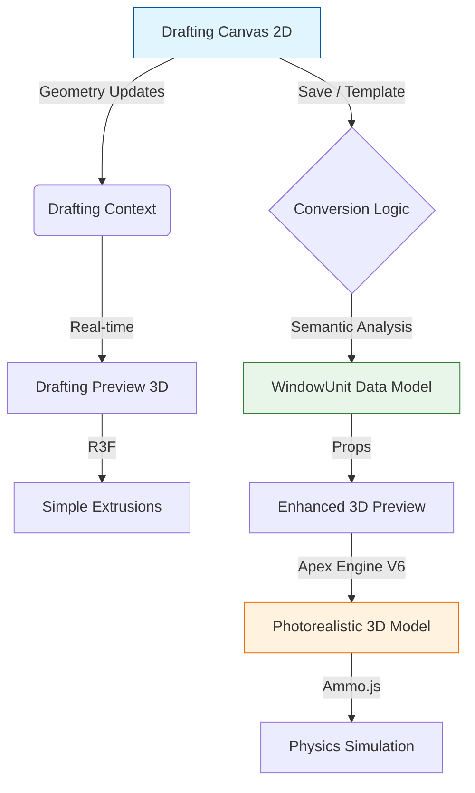

# Fabricator Pro: 2D & 3D Integration Architecture

> **Target Audience:** Developers, Stakeholders, and 3D Specialists joining the Almona Fabricator Pro team.
> **Last Updated:** February 2026
> **Version:** 2.0 (Dual-Pipeline Architecture)

## 1. Executive Summary

Fabricator Pro employs a **Dual-Pipeline Architecture** to handle 2D drafting and 3D visualization. This separation ensures that the critical path for manufacturing (Drafting) remains fast, deterministic, and precise, while the visualization path (Project/Sales) can leverage high-fidelity rendering and physics without compromising drafting performance.

-   **Drafting Pipeline (2D):** A custom, high-performance canvas engine built for CAD-like precision. It is the "Source of Truth" for geometry.
-   **Visualization Pipeline (3D):** A React Three Fiber (R3F) based engine that consumes the 2D geometry to generate photorealistic, interactive 3D models with physics.

---

## 2. Architecture Overview

### The Bridge: From Sketch to Structure
The core challenge in Fabricator Pro is converting user sketches (rectangles, lines) into semantic window units (frames, sashes, glass, hardware).

---

## 3. The Drafting Engine (2D Source)

The 2D engine is the heart of the "Precision Design" mode. It allows users to draw constraint-based geometry.

*   **Location:** `src/components/fabricator/drafting/DraftingCanvas2D.tsx`
*   **Core Technology:** Native HTML5 Canvas API (via `OptimizedCanvasManager`).
*   **State Management:** `useDraftingEngine` (Custom hook with complex reducer).
*   **Key Files:**
    *   `DraftingCanvas2D.tsx`: React wrapper, handles events and UI overlays.
    *   `OptimizedCanvasManager.ts`: Imperative rendering engine. Handles zoom, pan, culling, and drawing loops. **(Critical for Performance)**.
    *   `useDraftingEngine.ts`: Logic core. Manages constraints, undo/redo, and geometric relationships.

**Developer Note:** The 2D engine does *not* know about "Sashes" or "Frames" directly. It knows about `Rectangles`, `Lines`, and `Joints`. Meaning is assigned later.

---

## 4. The 3D Visualization Pipelines

We have two distinct 3D experiences served by different components:

### A. The "Drafting Preview" (Instant Feedback)
Used inside the Drafting Workbench to verify shape and scale instantly.

*   **Component:** `DraftingPreview3D.tsx` -> `DraftingCanvas3D.tsx`
*   **Input:** Raw Drafting Geometry (`rectangles` array).
*   **Behavior:** Deterministic, fast, lightweight.
*   **Implementation:**
    *   Iterates over `geometry.rectangles`.
    *   Extrudes simple box geometries using `THREE.ExtrudeGeometry`.
    *   Applies basic "Ghost" materials.
*   **Goal:** "Does this look like what I drew?"

### B. The "Project Preview" (High Fidelity)
Used in the Project Studio, Reports, and Sales presentations.

*   **Component:** `Enhanced3DPreview.tsx` -> `Window3DGenerator.tsx`
*   **Input:** `WindowUnit` (Semantic Data Model).
*   **Engine:** **Apex Engine V6** (`Window3DGenerator`).
*   **Features:**
    *   **Physics:** Integration with `Ammo.js` for real sash opening/closing physics (gravity, hinges, friction).
    *   **Photorealism:** PBR Materials (Gold Tier), SSAO (Screen Space Ambient Occlusion), Shadows.
    *   **Exploded Views:** Dynamic component expansion.
    *   **Cross-Sections:** Interactive slicing gizmos.

**Developer Note:** This engine is heavy. It uses `React.memo` and debouncing extensively to prevent main-thread blocking during configuration.

---

## 5. Integration & Data Flow

### The "Conversion" Step
The magic happens when a user saves a draft as a specific system (e.g., "Casement Window").
`DraftingWorkbenchTabs.tsx` contains logic (via `convertDraftingToWindowGrid`) to:
1.  Analyze the 2D layout.
2.  Map rectangles to semantic roles (Frame, Sash, Glass) based on nesting.
3.  Inject System definitions (Profile widths, offsets) from the `SystemPack`.
4.  Produce a `WindowUnit` object.

### Synchronization
*   **Drafting Mode:** 2D state changes -> Context Update -> 3D Draft Preview re-renders.
*   **Project Mode:** `WindowUnit` prop changes -> `useEffect` debounce -> `Window3DGenerator` recalculates geometry -> R3F Canvas updates.

---

## 6. Guide for 3D Developers

If you are joining to work on the 3D features, here is your roadmap:

### Tech Stack
*   **Framework:** React 18
*   **3D Library:** `@react-three/fiber` (R3F), `@react-three/drei`
*   **Physics:** `@react-three/cannon` / `Ammo.js`
*   **State:** Zustand (global), React Context (local)

### Key Directories
*   `src/components/fabricator`: Main container components.
*   `src/components/fabricator/drafting`: The 2D engine.
*   `src/lib/3d`: The core 3D generation logic (`windowGeometry.ts`, `hardwarePlaceholder.ts`).
*   `src/lib/3d/goldTierMaterials`: Shaders and material definitions.

### Common Tasks
1.  **Adding a New System Type:**
    *   Define 2D constraints in `SystemPack`.
    *   Update `generateModelGeometries` in `src/lib/3d/windowGeometry.ts` to handle the new profile shapes.
    *   Add profile assets (GLTF or Path data).

2.  **Improving Physics:**
    *   Work in `Window3DGenerator.tsx`.
    *   Check `utils/hingeUtils.ts` for axis calculation.

3.  **Optimizing Performance:**
    *   Look at `OptimizedCanvasManager.ts` (2D) for render loop optimizations.
    *   Check `Window3DGenerator.tsx` for `useMemo` usage on geometries.

### Debugging Tips
*   **2D Invisible Shapes:** Check `OptimizedCanvasManager.ts` -> `isVisible`. It uses viewport culling.
*   **3D Geometric Errors:** Check `windowGeometry.ts`. We generate geometry procedurally; one wrong offset breaks the mesh.
*   **Physics Explosions:** Usually caused by overlapping colliders. Check `hingeUtils.ts` pivot points.

---

## 7. Future Roadmap

*   **WebGPU Integration:** To handle complex facades with thousands of elements.
*   **Simulated Wind Load:** Using 3D physics to simulate pressure on glass.
*   **AR/VR Mode:** "View in Room" feature for mobile devices (Preliminary support in `Enhanced3DPreview`).
