# Fabricator Pro — Workshop Operator Guide

**Audience:** workshop owners, technical staff, and administrators learning ALMONA Fabricator Pro end to end.  
**Live site:** [https://www.almona02.com](https://www.almona02.com)  
**Last updated:** 6 October 2026  

This guide teaches the **manufacturing workflow** as a sequence of gated steps. Each step must be completed honestly. Status labels such as Complete, Blocked, or Estimate only are evidence-backed; they are not decorative.

**Live screenshots** below were captured on production (`www.almona02.com`) against lab project **FP-WYZ8XF** / revision **R5** (E2E Frame+Sash pack). They show the real chrome and gates — including Blocked states when prerequisites are missing. Image files live in [`fabricator-operator-guide-screenshots/`](./fabricator-operator-guide-screenshots/).

**In-Studio floor reference (EN / AR / TR):**  
`/fabricator/studio/help` — short gated principles, pipeline, R#, roles, packs, stock, troubleshooting, and assessment checklist. Use that surface for training and print; use this markdown for the full university lab with screenshots.

---

## Learning outcomes

After working through this guide you will be able to:

1. Sign in, open Fabricator Studio, and read the **active revision (R#)**.
2. Understand how accounts and roles work (and what requires administrator setup outside the browser).
3. Create a **system pack**, add **frame / sash** profiles, set roles, and mark the pack **Tuned**.
4. Request **catalogue and cutting-rule** review for manufacturing authority.
5. **Purchase / intake** stock against owned profiles.
6. Run a full pose: **project → pose → measure → design → BOM → stock acknowledgement → optimize → quote** (and what happens next on production / QC).

---

## Module 0 — Principles (read once)

| Principle | What it means on the floor |
| --- | --- |
| Human validation | Software proposes cuts and checks stock. A person qualifies the BOM, acknowledges stock, freezes release, and signs QC. |
| No self-approved manufacturing authority | You may **request** catalogue / cutting-rule approval. Reviewer approval is performed by a trusted backend process — the browser cannot approve itself. |
| Soft stock acknowledgement | “Acknowledge stock” checks coverage for the **current revision**. It does **not** remove metres from the ledger. |
| Revision discipline | Every saved change to a position bumps **R#**. Stock ack, BOM, optimization, release, and QC must match the **same** R#. |
| Owner scope | Fabricator inventory and packs belong to the signed-in account (`owner_user_id`). They are not an automatic company-wide shared warehouse unless you deliberately share credentials or build a server-side team model. |

---

## Module 1 — Sign in and open Fabricator Studio

### 1.1 Sign in

1. Open [https://www.almona02.com/login](https://www.almona02.com/login).
2. Enter email and password.
3. After sign-in, go to Fabricator Studio:

   **Command (home):**  
   `https://www.almona02.com/fabricator/studio/command`

   Shorthand redirect: `https://www.almona02.com/fabricator`

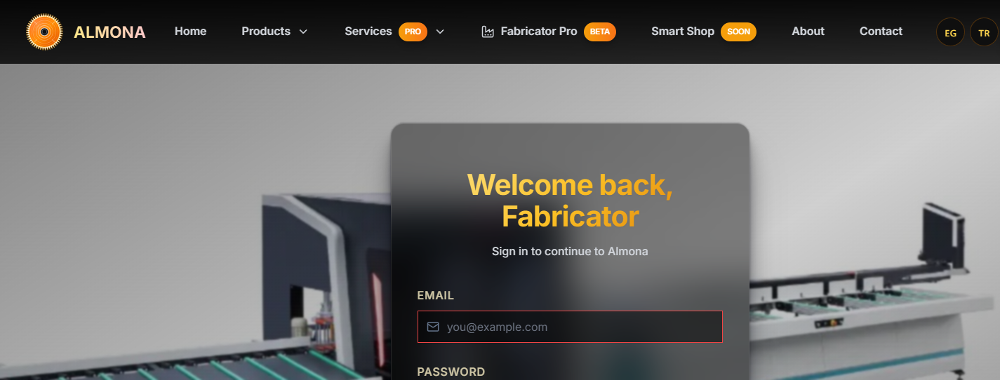

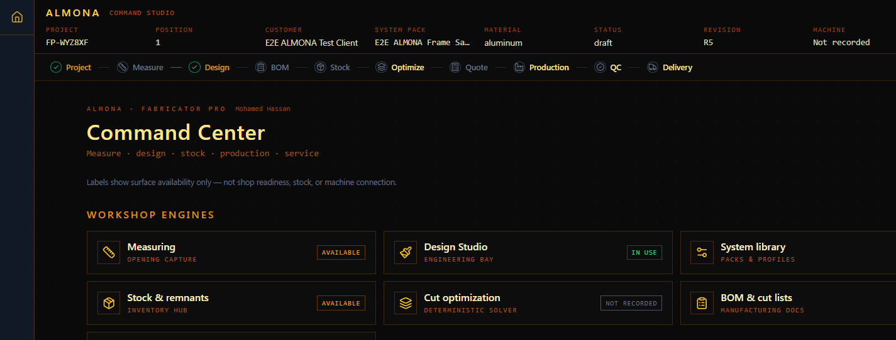

### 1.2 Studio map (bookmark these)

| Area | URL |
| --- | --- |
| Projects | `/fabricator/studio/projects` |
| New project | `/fabricator/studio/projects?new=true` |
| System packs | `/fabricator/studio/data` |
| Profiles | `/fabricator/studio/data/profiles` |
| Stock | `/fabricator/studio/data/stock` |
| DXF tuning | `/fabricator/studio/data/tuning` |
| No-DXF tuning | `/fabricator/studio/data/tuning-no-dxf` |

Pose steps live under:

`/fabricator/studio/projects/{projectId}/positions/{poseId}/…`

| Step | Path suffix |
| --- | --- |
| Measure | `/measuring` |
| Design | `/design` |
| BOM | `/bom` |
| Optimize | `/optimization` |
| Quote | `/commercial` |
| Production | `/production` |

**Stock acknowledgement** for the active pose is done on the shared stock page:  
`/fabricator/studio/data/stock`  
(not nested under the pose URL).

QC and Delivery use production studio query links:

- QC: `/fabricator/studio/production/quality?projectId=…&poseId=…`
- Delivery: `/fabricator/studio/production/delivery?projectId=…&poseId=…`

### 1.3 Read the chrome (status bar)

At the top of a pose you will see project code, position, system pack, status, and **REVISION R#**.

Examples of honest save / manufacturing chrome:

- `Revision loaded · R5` — client identity matches the saved position revision.
- `Unsaved draft` — design changes are not yet the authoritative saved design.
- Soft stock ack: `R5 · available` (or short-stock wording if coverage fails).

Treat **Blocked** messages in the workflow bar as required homework, not optional warnings.

---

## Module 2 — Active revision (R#) — university definition

### 2.1 What R# is

Each pose (position) has a manufacturing revision counter, shown as **R1, R2, R3…**.  
Internally this is the position’s `qc_revision`, part of the **workflow identity**:

`owner + project + position + source + revision`

Anything manufacturing-critical (qualified BOM, soft stock ack, optimization evidence, shop release, QC, delivery QR) must refer to **that exact identity**.

### 2.2 When R# increases

Saving updates to the pose (measurement, design, and other position writes) increments the revision.  
After a bump:

1. Old soft stock acknowledgements are **stale**.
2. You must **regenerate / re-qualify** the BOM for the new R#.
3. You must **re-acknowledge** stock for the new R# before optimization can proceed.

### 2.3 Classroom rule

> Never optimize or release against a different revision than the one on the chrome.  
> If the UI says the revision changed, stop and regenerate BOM → re-ack stock → re-optimize.

---

## Module 3 — Users, roles, and “same company”

### 3.1 Self-service registration (customer)

1. Open `/register`.
2. Provide name, email, phone, company, sector, workshop location.
3. New accounts are created as **`customer`**. The registration form does **not** let you choose Admin or Technician.

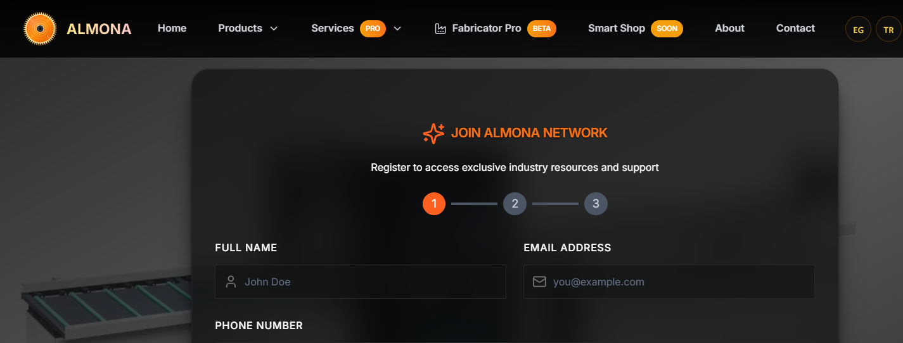

### 3.2 Roles that exist in the system

Schema roles include: `customer`, `admin`, `sales_rep`, `technician`, `support`.

| Role intent (typical) | Self-serve in browser? |
| --- | --- |
| Customer / workshop owner | Yes — register |
| Technician | **No** — must be set by a privileged server/admin process |
| Admin | **No** — must be set by a privileged server/admin process |

There is **no invite-another-user screen** in Fabricator Studio today. Team tables may exist in the database, but operators cannot provision colleagues from the UI.

### 3.3 Same company — what to tell staff

Fabricator packs and stock are **owned by the signed-in user**. Two people with two logins do **not** automatically share one warehouse or one system-pack library.

**Recommended workshop practice (until a team product exists):**

1. Decide one **owner account** that holds packs, stock, and live jobs (or use a dedicated workshop login).
2. Ask ALMONA / your system administrator to create additional Auth users and set `profiles.role` to `technician` or `admin` **with service-role privileges**.
3. If you need shared stock, either share that workshop account under local policy, or request a multi-owner / tenant feature — do not assume company name alone shares data.

### 3.4 Admin checklist (outside the operator UI)

For each new technical user (performed by ALMONA ops or a DB administrator with service role — not by browser self-approval):

1. Create the Auth user (email + password or invite email).
2. Ensure a `profiles` row exists with the correct `role` (`technician` or `admin`).
3. Confirm the user can sign in at `/login` and open `/fabricator/studio/command`.
4. Document whether they use the shared workshop owner account for stock, or a separate owner scope.

---

## Module 4 — Manufacturing rules (catalogue + cutting rules)

Manufacturing release needs **approved** catalogue and cutting-rule evidence for the pack and revision. Operators **request**; reviewers **approve** outside self-serve UI.

### 4.1 Where to request

On the **BOM** step (and related manufacturing panels):

1. Open the pose BOM:  
   `/fabricator/studio/projects/{projectId}/positions/{poseId}/bom`
2. Find **Catalogue & manufacturing rules**.
3. Enter:
   - Catalogue document / version (clear reference, at least a few characters).
   - Cutting rules document / version.
   - Optional review notes.
4. Click **Request approval**.
5. Later click **Check approved versions**.
6. If approved versions appear, **Regenerate BOM** so the qualified BOM picks up that evidence.

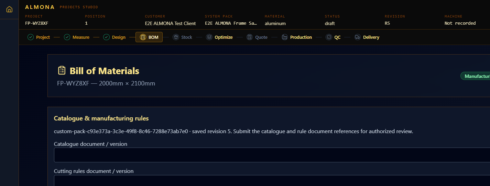

### 4.2 What you will see

| Message pattern | Meaning |
| --- | --- |
| Review request submitted; manufacturing remains blocked until reviewer approval | Request stored; wait for trusted review |
| Estimate only — manufacturing release blocked | BOM is not manufacturing-qualified yet |
| Manufacturing qualified | Catalogue / rules / identity evidence accepted for this BOM |

**Important:** you cannot click a button that self-approves manufacturing authority in the browser. That is intentional.

---

## Module 5 — System packs, profiles, roles, and “sealing” (Tuned)

In the product language, packs are **Tuned** or need tuning. There is no button literally named “Seal”; treat **Tuned** as the workshop seal for geometry / cutting readiness of the pack itself. Manufacturing **authority approval** (Module 4) is a separate gate.

### 5.1 Open the pack gallery

Go to: `/fabricator/studio/data`

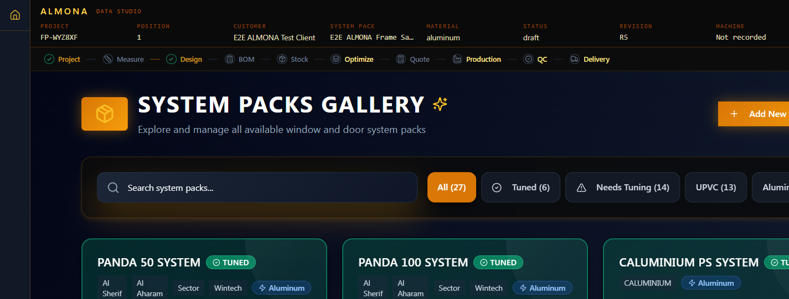

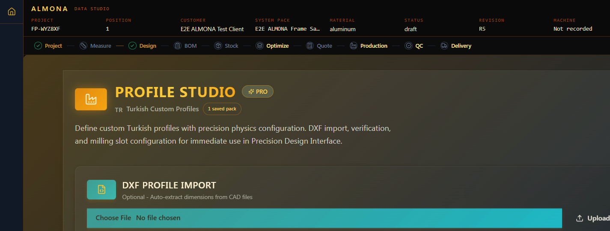

### 5.2 Create a new system pack (lab exercise)

1. Choose **Add New System Pack** (wizard on the gallery page).
2. Name the system clearly (include brand / series / date if useful).
3. Create at least:
   - one **frame** profile,
   - one **sash** profile.
4. Set physical basics: section sizes, bar length (often 6000 mm), material, cost if known.
5. Save. Confirm the pack appears in the gallery and can be selected in a new project.

Alternative path for profile-first work:

- `/fabricator/studio/data/profiles` (**Profile Studio**) — define profiles; a custom pack can be created when frame + sash exist.

### 5.3 Assign and adjust profile roles

Roles you will use most:

- `frame`
- `sash`
- (also: mullion, transom, bead / glazing bead, etc.)

**Lab rule:** every purchasable structural line must have a correct role. Wrong roles break BOM cuts and stock demand matching.

### 5.4 Tune / “seal” the pack

1. From the gallery, open **Tune System** (No-DXF) or profile tuning:
   - No-DXF: `/fabricator/studio/data/tuning-no-dxf?systemPackId=…`
   - DXF tuning: `/fabricator/studio/data/tuning?systemPackId=…`
2. Complete required geometry / cutting parameters for your workshop.
3. **Save** until the pack shows **Tuned** (not “needs tuning”).

**Exam question:** Is a Tuned pack automatically manufacturing-qualified for a pose?  
**Answer:** No. Tuning is pack readiness. Pose BOM still needs approved catalogue/cutting-rule evidence (Module 4) and a matching revision.

---

## Module 6 — Purchase stock or add intake

Go to: `/fabricator/studio/data/stock`

Sign in is required. Catalogue packs are not the same thing as **owned workshop inventory**.

### 6.1 Purchase Wizard (preferred for new owned profiles)

1. Open the **Purchases** tab.
2. Click **Open Purchase Wizard**.
3. Select a system pack that has purchasable profiles (empty catalogue packs are disabled until profiles exist).
4. Choose profiles by role (frame, sash, …), quantities, and bar lengths.
5. Complete the wizard so owned profiles are materialized and intake is recorded.

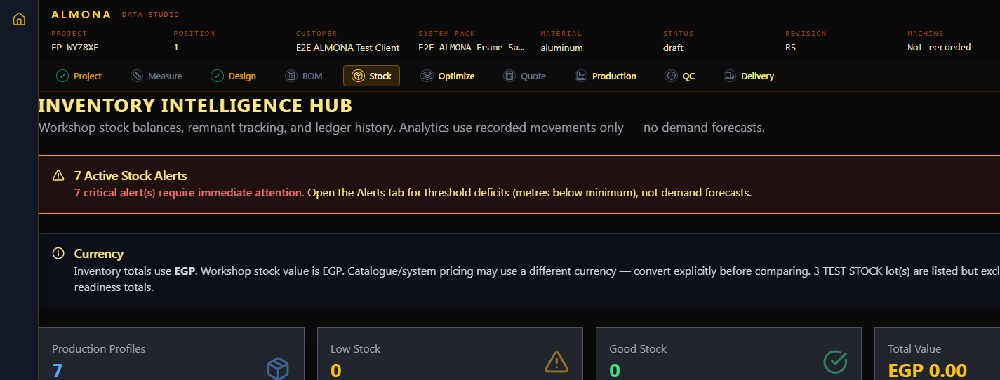

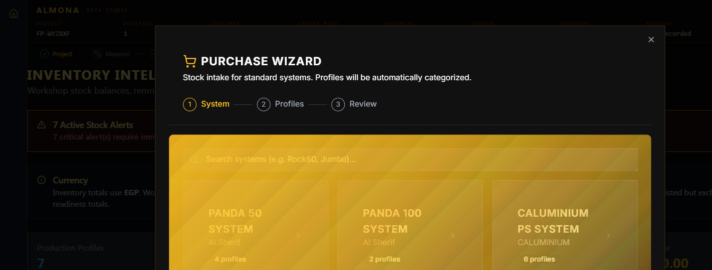

### 6.2 Stock intake by invoice (add to existing owned profiles)

On the same stock page:

1. Select series / pack and profile.
2. Enter quantity (bars or metres as prompted).
3. Enter bar length (m), invoice number, supplier, paint finish if relevant.
4. Click **Record Purchase & Update Stock**.
5. Confirm the movement appears under recent movements / History.

Optional: import CSV with columns such as `profile_code`, `quantity`, `unit`, `bar_length_m`, `invoice_no`, `supplier`.

### 6.3 Soft acknowledgement vs real consumption

| Action | Deducts ledger? |
| --- | --- |
| Acknowledge stock for this revision | **No** — soft availability check |
| Purchase / invoice intake | **Adds** stock |
| Production “confirm consumption” / release flows | Follow on-screen evidence; do not assume metres moved unless History shows an `out` movement |

### 6.4 Test / disposable lots

If a lot is marked or named for testing, treat it as **inspection inventory**. Keep it out of operational readiness thinking; delete or quarantine when the exercise ends.

---

## Module 7 — Full manufacturing lab: project → quote

Work this as one continuous exercise. Use a **desktop / tablet landscape** viewport for Design (Engineering Bay). Phone layouts intentionally hide the editable canvas.

### Step A — Create a project

1. Open `/fabricator/studio/projects?new=true` (or **New project** from Projects).
2. Enter client / site / system pack (prefer your Tuned custom pack or a built-in pack you are authorized to use).
3. Save. Note the project code (for example `FP-……`).

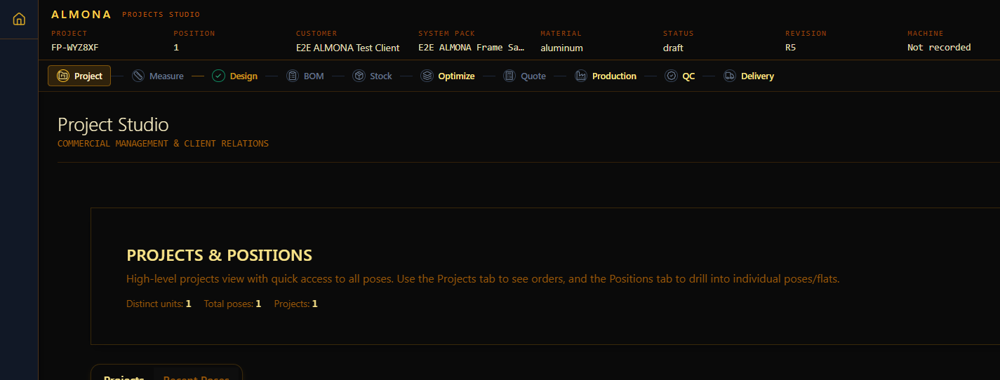

### Step B — Create a pose (position)

1. Open the project workspace.
2. Add position **1** (or next free pose).
3. Confirm the pose opens on **Measure**:  
   `…/positions/{poseId}/measuring`

### Step C — Measure

1. Enter width and height (mm), opening type, glazing, finish as required.
2. Confirm / finalize measurement so Design is allowed.
3. Gate reminder: *Record valid measurements before design.*

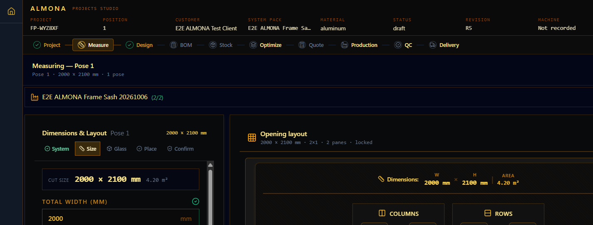

### Step D — Design

1. Open `…/design`.
2. Confirm **Active System** is your intended pack (frame + sash resolved — not “0 profiles”).
3. Choose a compatible window pattern for the sizes you measured.
4. Validate the design. Use **Review BOM** when ready (this should persist the authoritative design before BOM).
5. Note the chrome **R#** after save.

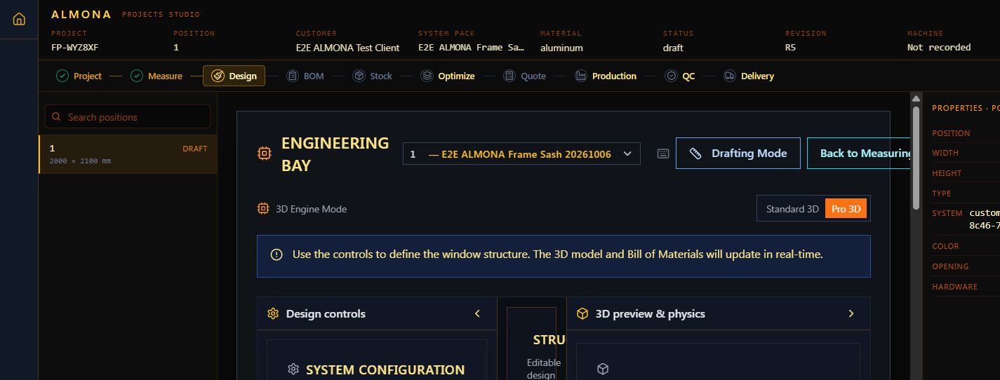

### Step E — BOM

1. Open `…/bom`.
2. Confirm a cut list appears (not a blank page). Profiles should list frame / sash cuts with lengths and piece counts.
3. If you see **Estimate only**, complete Module 4 (request / check approval) and regenerate.
4. When status is **Manufacturing qualified**, continue.
5. Gate reminders:
   - *Resolve the design components and profiles in Design.*
   - *The saved revision changed. Regenerate the BOM…*

### Step F — Stock acknowledgement

1. Open `/fabricator/studio/data/stock` with the project/pose still active in studio chrome.
2. Read **Active revision demand**: required metres vs available metres, shortage, bar lengths, Covered / short.
3. If short, return to Module 6 and purchase enough stock (do not fake coverage).
4. Click **Acknowledge stock for this revision**.
5. Confirm chrome shows acknowledgement for **this R#**.
6. Gate reminder: *Acknowledge stock availability for this revision before optimization.*

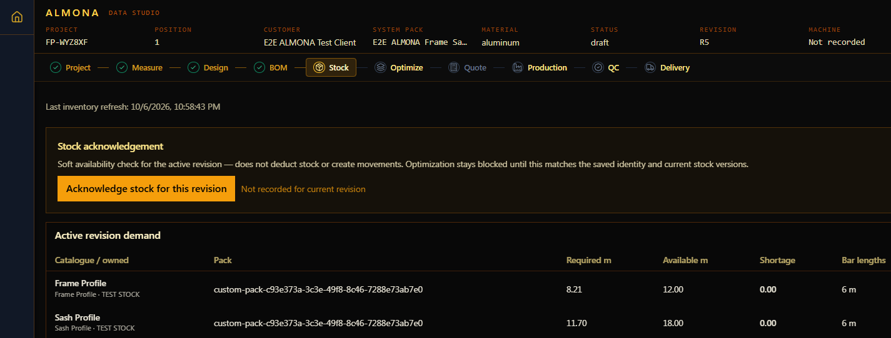

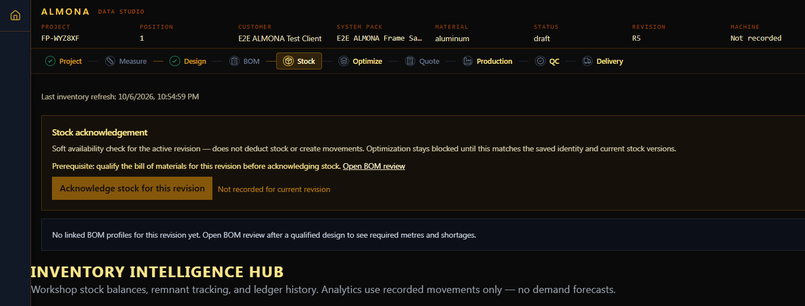

### Step G — Optimize

1. Open `…/optimization`.
2. When prerequisites pass, run optimization (via the page’s continue / equalizer completion control).
3. Verify:
   - required pieces match the BOM,
   - bars required are feasible given stock,
   - no unplaced cuts,
   - result is marked complete for this revision.
4. Optional: download cut-list PDF if offered; verify the file yourself before shop use.
5. Gate reminder: *A manufacturing-qualified BOM is required before optimization.*

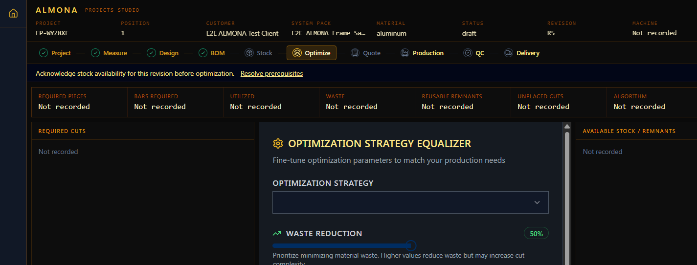

### Step H — Quote

1. Continue to `…/commercial` (Quote).
2. Review line items, markup, VAT.
3. **Save Quote** / export PDF as needed.
4. Treat commercial totals as commercial documents — still subject to human price confirmation.

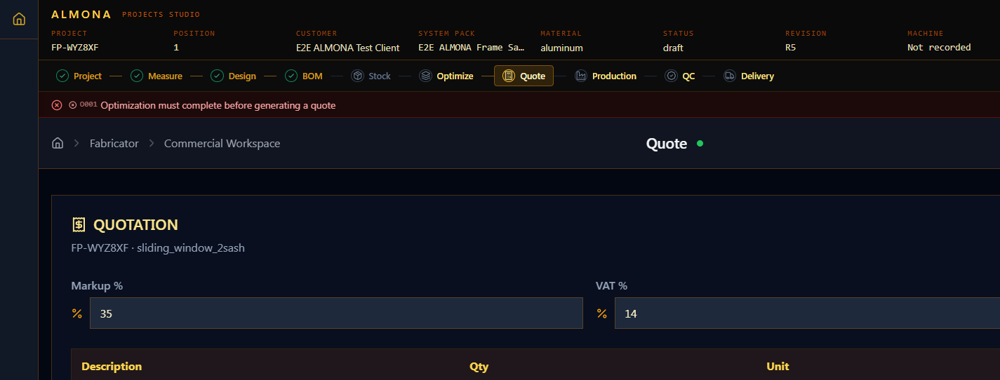

### Step I — Beyond quote (orientation only)

| Step | What “done” means |
| --- | --- |
| Production | Manual shop release / freeze for the revision — not a claim that CNC finished |
| QC | Requires release freeze + inspection evidence; may block if dimensional-tolerance authority is missing |
| Delivery | Requires acknowledged QC for the same R# |

Do not skip QC gates with screenshots alone.

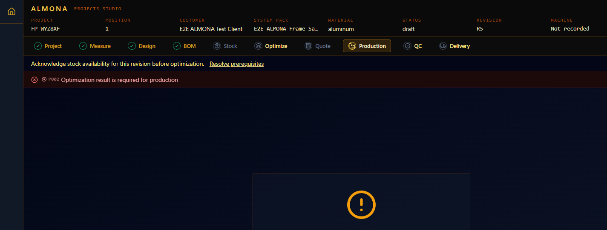

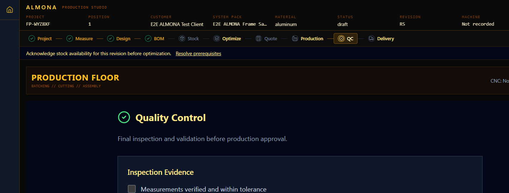

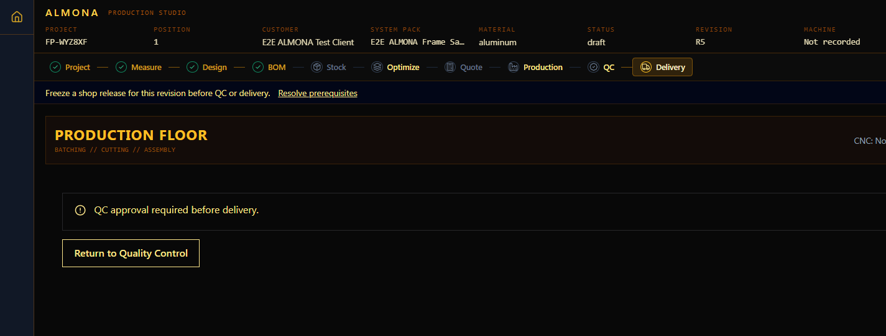

---

## Module 8 — Troubleshooting cheat sheet

| Symptom | Likely cause | Fix |
| --- | --- | --- |
| Design says pack has 0 profiles | Custom pack not resolved for this account | Confirm pack saved for this owner; reload; open pack gallery / No-DXF save |
| BOM page blank | Pack not resolved for BOM review | Ensure custom pack is owned + available; regenerate from Design → Review BOM |
| Optimize blocked: acknowledge stock | Soft ack missing or wrong R# | Stock page → Acknowledge for current R# |
| Optimize blocked: qualify BOM | Estimate-only BOM | Request/check manufacturing approval; regenerate BOM |
| Stock ack for different revision | R# bumped after ack | Re-ack on current R# |
| Old UI after deploy | Stale service worker cache | Use in-app **Reload after saving** update toast; avoid relying on manual cache clear |
| QC blocked: tolerance rule | No approved dimensional tolerance | Obtain workshop-approved tolerance evidence; do not invent |

---

## Module 9 — Recommended classroom sequence (one session)

| Time box | Module | Deliverable |
| --- | --- | --- |
| 10 min | 0–2 | Can explain R# and soft ack |
| 15 min | 5 | Custom pack with frame + sash, Tuned |
| 10 min | 4 | Approval approval recorded (or documented pending) |
| 15 min | 6 | Invoice or wizard intake covering planned metres |
| 40 min | 7 A–H | One pose through qualified BOM, stock ack, optimize, quote |
| 10 min | 8 | Written note of any Blocked gates still open |

---

## Module 10 — Assessment checklist (pass/fail)

Mark **Pass** only with live evidence (screenshot or revision chrome), not memory.

- [ ] Signed in; opened `/fabricator/studio/command`
- [ ] Explained active revision R# and when it bumps
- [ ] Stated correctly that register creates `customer` only; admin/technician need privileged setup
- [ ] Created or selected a system pack with frame + sash roles
- [ ] Pack shows Tuned (or documented why not)
- [ ] Requested catalogue + cutting-rule review (or documented pending reviewer)
- [ ] Recorded stock intake / purchase covering demand
- [ ] Created project + pose; completed measure + design for a saved R#
- [ ] BOM manufacturing-qualified for that R#
- [ ] Soft stock acknowledged for that R#
- [ ] Optimization completed with placed cuts
- [ ] Quote saved or exported
- [ ] Listed remaining Production / QC / Delivery gates honestly

---

## Appendix A — Constitutional reminder (AICS-001)

ALMONA Fabricator Pro is an **industrial computing** tool. Adaptive or advisory features must not replace:

- deterministic cutting constraints,
- human validation of outputs,
- workshop-approved catalogue and rules.

Do not treat marketing “AI” labels in unrelated menus as a license to skip gates.

---

## Appendix B — Quick links

| Topic | Link |
| --- | --- |
| Login | https://www.almona02.com/login |
| Register | https://www.almona02.com/register |
| Studio | https://www.almona02.com/fabricator/studio/command |
| Projects | https://www.almona02.com/fabricator/studio/projects |
| Packs | https://www.almona02.com/fabricator/studio/data |
| Profiles | https://www.almona02.com/fabricator/studio/data/profiles |
| Stock | https://www.almona02.com/fabricator/studio/data/stock |

---

## Appendix C — Live screenshot index

All images: `docs/guides/fabricator-operator-guide-screenshots/`  
Captured **6 October 2026** on `https://www.almona02.com` (project **FP-WYZ8XF**, pose 1, **R5**).

| # | File | Step |
| --- | --- | --- |
| 01 | `01-login.png` | Sign in |
| 02 | `02-register.png` | Register (customer) |
| 03 | `03-studio-command.png` | Studio command |
| 04 | `04-system-packs.png` | System packs gallery |
| 05 | `05-profiles.png` | Profile Studio |
| 06 | `06-stock-ack-demand.png` | Stock demand / coverage |
| 07 | `07-stock-intake-purchases.png` | Purchases tab |
| 08 | `08-purchase-wizard.png` | Purchase Wizard |
| 09 | `09-projects-list.png` | Projects list |
| 10 | `10-projects-filtered.png` | Project filter FP-WYZ8XF |
| 11 | `11-measuring.png` | Measure |
| 12 | `12-design.png` | Design / Engineering Bay |
| 13 | `13-bom-review.png` | BOM + manufacturing request |
| 14 | `14-stock-acknowledgement.png` | Soft stock ack |
| 15 | `15-optimization.png` | Optimize (gate visible) |
| 16 | `16-quote-commercial.png` | Quote |
| 17 | `17-production.png` | Production (gate visible) |
| 18 | `18-qc-quality.png` | QC |
| 19 | `19-delivery.png` | Delivery (QC gate) |

---

*End of guide.*
